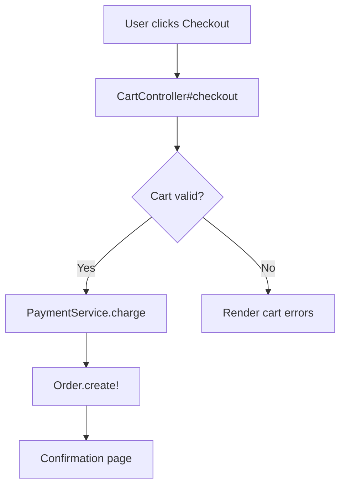

# Write a documentation page for Doc Viewer

You are writing a Markdown documentation page for a repo-agnostic documentation viewer. These pages look like normal Markdown but have one critical difference: **Mermaid diagrams contain `click` directives that link diagram nodes to actual source code files in the target repository.** When a user clicks a node in the rendered diagram, a popover shows the real source code.

## Format Rules

### Frontmatter

```yaml
---
title: Page Title
description: Short description shown on parent index cards.
tags: [relevant, keywords]
---
```

### Internal links use routes, not file paths

Links between doc pages use route paths — no `.md` extension. Routes mirror the directory structure under the docs folder, with `index.md` mapping to the bare directory path.

```markdown
[Other Page](../sibling-page)        <!-- correct -->
[Other Page](../sibling-page.md)     <!-- WRONG -->
```

Links resolve relative to the current page's parent directory. A page at `/outreach/workflows/foo` resolves links relative to `/outreach/workflows`.

### Mermaid click directives — the key feature

Inside mermaid fences, `click` lines bind a diagram node to a source file in the repo. The exact format is:

```
click <NodeID> href "#" "<repo-root-relative-path>"
click <NodeID> href "#" "<repo-root-relative-path>:<startLine>-<endLine>"
```

- `href "#"` is mandatory and literal — the app intercepts clicks via JS.
- File paths are relative to the **repository root**, not the docs directory.
- Line ranges require both start and end (`:10-25`). Single lines need `:10-10`.
- Omitting the line range shows the full file (truncated at 100 lines in the UI).

For **sequence diagrams**, participants need the `as` syntax for click matching to work:

```
participant C as Controller
click C href "#" "app/controllers/foo.rb:10-30"
```

## Contrived example

Below is a doc page that shows every feature. Compare it to plain Markdown — the structure is identical except for the `click` directives inside mermaid fences.

````markdown
---
title: Placing an Order
description: How an order flows from cart to confirmation.
tags: [orders, checkout]
---

## Overview

The checkout flow validates the cart, charges payment, and creates an order
record. For return policies, see [Returns](../returns/process).

## Checkout Flow



Without the `click` lines above, this would be an ordinary Mermaid flowchart.
With them, clicking "CartController#checkout" in the rendered diagram opens a
popover showing lines 44-67 of `cart_controller.rb` with syntax highlighting.

## Sequence Detail

```mermaid
sequenceDiagram
  participant C as Cart<br/>Controller
  participant P as Payment<br/>Service
  participant O as Order<br/>Model

  C->>P: charge(cart)
  P-->>C: payment_id
  C->>O: create!(payment_id)
  O-->>C: order

  click C href "#" "app/controllers/cart_controller.rb:44-67"
  click P href "#" "app/services/payment_service.rb:12-38"
  click O href "#" "app/models/order.rb"
```
````

## What to remember

1. **The `click` directive is the only non-standard Markdown here.** Everything else is normal GFM.
2. **`href "#"` is required verbatim** — without it the directive is silently ignored.
3. **File paths point to the repo root**, not the docs folder. Think `app/models/foo.rb`, not `docs/models/foo.md`.
4. **Line ranges use `:start-end`** and both bounds are required. Omit the range entirely to reference the whole file.
5. **Sequence diagram participants** must use `participant ALIAS as Name` so the viewer can match clicks to rendered SVG elements.
6. **Internal doc links** use route paths with no `.md` extension.

$ARGUMENTS
