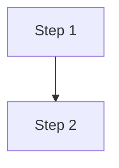

# Doc Explorer

A static documentation site generator that renders interactive Mermaid diagrams with source code popovers. Write markdown with annotated flowcharts and sequence diagrams, and Illumina builds a browsable site where clicking a diagram node shows the actual source code it references.

## Quick start

From any repository that has a `docs/` directory with markdown files:

```bash
npx github:marcus-gc/outreach-docs create
```

This generates a static site in `_site/` ready to be deployed.

## CLI usage

```
doc-explorer create [options]
```

### Options

| Flag | Default | Description |
|------|---------|-------------|
| `--docs-path <path>` | `docs` | Path to the docs directory in your repo |
| `--output <dir>` | `_site` | Output directory for the built site |
| `--base <path>` | `/` | Base path for asset URLs (for subdirectory hosting) |

### Examples

Build with defaults:

```bash
npx github:givecampus/doc-explorer create
```

Custom docs directory and output:

```bash
npx github:givecampus/doc-explorer create --docs-path documentation --output dist
```

For GitHub Pages hosted at `https://<org>.github.io/<repo>/`:

```bash
npx github:givecampus/doc-explorer create --base /my-repo/
```

## Adding to your repository

### 1. Write documentation

Create markdown files in your docs directory using YAML frontmatter and Mermaid code fences with click directives that link diagram nodes to source code:

```markdown
---
title: Creating an Outreach
description: How the outreach creation flow works
tags: [outreach, controllers]
---

## Overview

Prose explaining the workflow...

## Flowchart

` ``mermaid
flowchart TD
  A[User submits form] --> B[Controller processes request]
  B --> C[Service creates record]
  click A href "#" "app/controllers/outreaches_controller.rb:15-30"
  click B href "#" "app/controllers/outreaches_controller.rb:32-58"
  click C href "#" "app/services/outreach_creator.rb:10-45"
` ``
```

The `click` directives link diagram nodes to source files. Format: `click <NodeID> href "#" "<filepath>:<startLine>-<endLine>"`. The line range is optional — omitting it shows the full file.

### 2. Directory structure

The directory structure determines URL routes:

```
docs/
  index.md          → /
  outreach/
    index.md        → /outreach
    creation.md     → /outreach/creation
    workflows/
      approval.md   → /outreach/workflows/approval
```

- `index.md` files become section pages that show cards linking to child pages
- Non-index files are leaf pages with full content

### 3. Add a build script

Add a convenience script to your `package.json`:

```json
{
  "scripts": {
    "docs:build": "npx github:marcus-gc/outreach-docs create --base /my-repo/"
  }
}
```

### 4. Deploy with GitHub Actions

Create `.github/workflows/docs.yml`:

```yaml
name: Deploy docs
on:
  push:
    branches: [main]
    paths: ['docs/**']

permissions:
  pages: write
  id-token: write

jobs:
  deploy:
    runs-on: ubuntu-latest
    environment:
      name: github-pages
    steps:
      - uses: actions/checkout@v4
      - uses: actions/setup-node@v4
        with:
          node-version: 20
      - run: npx github:marcus-gc/outreach-docs create --base /${{ github.event.repository.name }}/
      - uses: actions/upload-pages-artifact@v3
        with:
          path: _site
      - uses: actions/deploy-pages@v4
```

## Diagram features

### Flowcharts



### Sequence diagrams

Participant aliases map display names to clickable nodes:

```mermaid
sequenceDiagram
  participant C as Controller
  participant S as Service
  C->>S: call method
  click C href "#" "app/controllers/foo_controller.rb:5-20"
  click S href "#" "app/services/foo_service.rb:12-30"
```

### Line ranges

- `app/models/user.rb:10-25` — shows lines 10-25 with 2 lines of surrounding context
- `app/models/user.rb` — shows the full file (truncated at 100 lines in the UI)

## Local development

For developing Illumina itself:

```bash
# Install build + app dependencies
cd build && npm install && cd ../app && npm install && cd ..

# Configure source repo access
cp .env.example .env
# Edit .env — set LOCAL_REPO_ROOT or GITHUB_TOKEN

# Run the dev server (port 3100)
cd app && npm run dev
```

To skip re-fetching and use cached JSON:

```bash
cd app && npm run dev:cached
```

### Pointing at a different repo

Set these in `.env`:

```
LOCAL_REPO_ROOT=/path/to/your-repo
DOCS_PATH=docs
```

Or use the GitHub API:

```
GITHUB_TOKEN=ghp_xxxxxxxxxxxx
GITHUB_OWNER=your-org
GITHUB_REPO=your-repo
GITHUB_REF=main
DOCS_PATH=docs
```

## Settings

Click the gear icon in the app header to configure:

- **Editor** — which editor to open files in (VS Code, Cursor, RubyMine, etc.)
- **Local repo path** — path to your local repo clone for "Open in Editor" links
