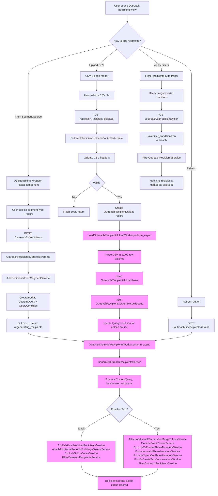

## Overview

After an outreach is created in `draft` state, recipients must be added before it can be sent. There are two primary methods for adding recipients: **from a segment/source** (events, segments, campaigns, donors, etc.) and **via CSV upload**. Both methods are asynchronous -- the user initiates the action and a background worker generates the final recipient list by executing queries, deduplicating, and applying exclusion filters.

Recipients are stored as `OutreachRecipient` records linked to the outreach. Each recipient can be in one of four states: `pending`, `sent`, `failed`, or `excluded`. Associated data (person records, CRM data, contributions, etc.) is linked via the polymorphic `OutreachRecipientRecord` join table, enabling merge token substitution at send time.

---

## Flowchart: Decision Points & Branching



> Pink nodes indicate **asynchronous background processing** (Sidekiq).

---

## Sequence Diagram: Component Interactions

### Adding from Segment

```mermaid
sequenceDiagram
    actor User
    participant FE as React Frontend<br/>(AddRecipientsWrapper)
    participant Ctrl as OutreachRecipientsController
    participant Auth as OutreachRecipientPolicy
    participant Svc as AddRecipientsFrom<br/>SegmentService
    participant DB as Database
    participant Redis as Redis
    participant Sidekiq as Sidekiq
    participant GenW as GenerateOutreach<br/>RecipientsWorker
    participant Filters as Exclusion Services

    User->>FE: Click "Add Recipients"
    FE->>FE: Render segment type + record selectors
    User->>FE: Select segment type and record
    User->>FE: Submit

    FE->>Ctrl: POST /outreach/:id/recipients
    Ctrl->>Auth: authorize (can_manage_recipients?)
    Auth-->>Ctrl: Authorized

    Ctrl->>Svc: AddRecipientsFromSegmentService.call
    Svc->>DB: Find or create CustomQuery
    Svc->>DB: Create QueryCondition with segment data
    Svc-->>Ctrl: Done

    Ctrl->>Redis: SET outreach_{id}_status = "regenerating_recipients" (TTL: 1h)
    Ctrl->>Sidekiq: GenerateOutreachRecipientsWorker.perform_async
    Ctrl-->>User: Flash "Recipients are being created"

    Note over Sidekiq,DB: Async processing

    Sidekiq->>GenW: Execute
    GenW->>DB: Execute CustomQuery.fetch_mixed_records
    GenW->>DB: Batch insert OutreachRecipient records (5,000/batch)
    GenW->>DB: Batch insert OutreachRecipientRecord associations

    GenW->>Filters: Run exclusion pipeline
    Filters->>DB: Exclude unsubscribed (email only)
    Filters->>DB: Attach additional records for merge tokens
    Filters->>DB: Exclude solicit codes
    Filters->>DB: Apply filter_conditions

    GenW->>Redis: DELETE outreach_{id}_status
    GenW-->>Sidekiq: Complete

    click FE href "#" "app/javascript/react_frontend/outreach/AddRecipientsWrapper/AddRecipientsWrapper.jsx:9-98"
    click Ctrl href "#" "app/controllers/categories/admin/outreach_recipients_controller.rb:29-49"
    click Auth href "#" "app/policies/outreach_recipient_policy.rb:46-48"
    click Svc href "#" "app/services/outreaches/add_recipients_from_segment_service.rb:11-76"
    click GenW href "#" "app/workers/outreaches/generate_outreach_recipients_worker.rb:10-30"
```

### Uploading CSV

```mermaid
sequenceDiagram
    actor User
    participant FE as CSV Upload Modal
    participant Ctrl as OutreachRecipient<br/>UploadsController
    participant Model as OutreachRecipientUpload
    participant Sidekiq as Sidekiq
    participant LoadW as LoadOutreachRecipient<br/>UploadWorker
    participant GenW as GenerateOutreach<br/>RecipientsWorker
    participant DB as Database

    User->>FE: Select CSV file
    User->>FE: Submit upload

    FE->>Ctrl: POST /outreach_recipient_uploads
    Ctrl->>Model: Create OutreachRecipientUpload
    Model->>Model: Validate required headers
    Model->>Model: Validate custom token headers (max 50)

    alt Invalid headers
        Model-->>Ctrl: Validation errors
        Ctrl-->>User: Flash error message
    else Valid headers
        Model->>DB: Save upload record
        Ctrl->>Sidekiq: LoadOutreachRecipientUploadWorker.perform_async
        Ctrl-->>User: Flash "CSV is being processed"
    end

    Note over Sidekiq,DB: Async processing

    Sidekiq->>LoadW: Execute
    LoadW->>LoadW: Parse CSV file

    loop Every 1,000 rows
        LoadW->>DB: Insert OutreachRecipientUploadRow batch
        LoadW->>DB: Upsert OutreachRecipientCustomMergeToken batch
    end

    LoadW->>DB: Create QueryCondition (outreach_recipient_upload type)
    LoadW->>DB: Mark upload as processed: true
    LoadW->>Sidekiq: GenerateOutreachRecipientsWorker.perform_async

    Sidekiq->>GenW: Execute (same pipeline as segment flow)
    GenW->>DB: Generate recipients from query
    GenW->>DB: Run exclusion pipeline
    GenW-->>Sidekiq: Complete

    click Ctrl href "#" "app/controllers/categories/admin/outreach_recipient_uploads_controller.rb:10-24"
    click Model href "#" "app/models/outreach_recipient_upload.rb:1-91"
    click LoadW href "#" "app/workers/load_outreach_recipient_upload_worker.rb:9-38"
    click GenW href "#" "app/workers/outreaches/generate_outreach_recipients_worker.rb:10-30"
```

---

## Routes & Controller Actions

### Recipient Management Routes

| Method | Path | Controller#Action | Purpose |
|--------|------|-------------------|---------|
| `GET` | `/outreach/:outreach_id/recipients` | `OutreachRecipientsController#index` | List recipients (paginated, 25/page) |
| `POST` | `/outreach/:outreach_id/recipients` | `OutreachRecipientsController#create` | Add recipients from segment/source |
| `DELETE` | `/outreach/:outreach_id/recipients/:id` | `OutreachRecipientsController#destroy` | Remove single recipient |
| `DELETE` | `/outreach/:outreach_id/recipients/destroy_all` | `OutreachRecipientsController#destroy_all` | Remove all recipients |
| `POST` | `/outreach/:outreach_id/recipients/filter` | `OutreachRecipientsController#filter` | Apply exclusion filters |
| `POST` | `/outreach/:outreach_id/recipients/refresh` | `OutreachRecipientsController#refresh` | Refresh recipient list |
| `DELETE` | `/outreach/:outreach_id/recipients/remove_source` | `OutreachRecipientsController#remove_source` | Remove a specific source |
| `DELETE` | `/outreach/:outreach_id/recipients/remove_filter` | `OutreachRecipientsController#remove_filter` | Remove a specific filter |
| `GET` | `/outreach/:outreach_id/recipients/index_modal` | `OutreachRecipientsController#index_modal` | Modal view with JSON support |
| `GET` | `/outreach/:outreach_id/recipients/:id/sources` | `OutreachRecipientsController#sources` | Show where a recipient came from |

### CSV Upload Routes

| Method | Path | Controller#Action | Purpose |
|--------|------|-------------------|---------|
| `POST` | `/outreach_recipient_uploads` | `OutreachRecipientUploadsController#create` | Upload CSV file |

### API Routes

| Method | Path | Controller#Action | Purpose |
|--------|------|-------------------|---------|
| `GET` | `/api/outreach_recipients/:id` | `Api::OutreachRecipientsController#show` | Get single recipient (JSON) |
| `GET` | `/api/outreach_recipients/autocomplete` | `Api::OutreachRecipientsController#autocomplete` | Fuzzy search recipients |

### Controller Filters

- All actions authorize via `OutreachRecipientPolicy#can_manage_recipients?`
- `before_action :check_if_feature_enabled?` on parent controller

---

## Performance Bottlenecks

### 1. Recipient Generation Pipeline (Critical - 5 min SLA, 15 min alert threshold)

**Location:** `GenerateOutreachRecipientsWorker` / `GenerateOutreachRecipientsService`

The same pipeline described in [Creating an Outreach](creating_an_outreach.md) runs every time recipients are added or refreshed. Each addition triggers a full regeneration of the recipient list, not an incremental update.

**Risk factors:**
- Adding multiple sources sequentially triggers multiple full regenerations
- Schools with very large constituent databases compound the query cost
- Text outreaches have more filtering steps than email (phone validation, opt-out checks, Twilio conversation creation)

### 2. CSV Processing for Large Files

**Location:** `LoadOutreachRecipientUploadWorker`

CSV files are parsed and inserted in 1,000-row batches. Large files (10,000+ rows) with custom merge tokens require both `OutreachRecipientUploadRow` and `OutreachRecipientCustomMergeToken` inserts per batch, doubling the DB write load.

**Mitigation:** Batch inserts via `insert_all`, concurrency lock prevents parallel processing of the same outreach.

### 3. Autocomplete Search with Deep Fuzzy Matching

**Location:** `Api::OutreachRecipientsController#autocomplete`

The autocomplete endpoint has three tiers of search: fuzzy, ILIKE, and deep fuzzy (searching associated records like CRM data and segment members). Deep fuzzy search is expensive and has a 5-second statement timeout. A feature flag (`disable_thorough_outreach_autocomplete`) auto-disables it per-outreach if it times out.

### 4. Twilio Conversation Creation (Text only)

**Location:** `FindOrCreateTextConversationsForOutreachRecipientsWorker`

For text outreaches, each recipient needs a Twilio conversation. This makes individual API calls to Twilio for each recipient without a conversation, which is slow for large recipient lists.

**Mitigation:** Runs as a separate worker with retry logic; Twilio errors gracefully exclude the recipient rather than failing the entire batch.

---

## Relevant Files

### Models
| File | Description |
|------|-------------|
| `app/models/outreach_recipient.rb` | Recipient with state machine (pending/sent/failed/excluded), merge token substitution |
| `app/models/outreach_recipient_record.rb` | Polymorphic join to associated data (Person, Contribution, SegmentMember, etc.) |
| `app/models/outreach_recipient_upload.rb` | CSV upload metadata, header validation, S3 file reference |
| `app/models/outreach_recipient_upload_row.rb` | Individual parsed CSV row data |
| `app/models/outreach_recipient_custom_merge_token.rb` | Custom merge token values from CSV (keyed by outreach + email + token) |
| `app/models/outreach_recipient_merge_token_review.rb` | Tracks which merge token value was selected when multiple options exist |
| `app/models/custom_query.rb` | Defines recipient query criteria, executed to generate recipient list |

### Controllers
| File | Description |
|------|-------------|
| `app/controllers/categories/admin/outreach_recipients_controller.rb` | Main controller: add, remove, filter, refresh recipients |
| `app/controllers/categories/admin/outreach_recipient_uploads_controller.rb` | CSV upload handling and validation |
| `app/controllers/categories/admin/api/outreach_recipients_controller.rb` | API: show recipient, autocomplete search |

### Services
| File | Description |
|------|-------------|
| `app/services/outreaches/add_recipients_from_segment_service.rb` | Creates QueryCondition for segment/event/project sources |
| `app/services/outreaches/generate_outreach_recipients_service.rb` | Executes CustomQuery, batch-inserts recipients (5,000/batch) |
| `app/services/outreaches/filter_outreach_recipients_service.rb` | Applies exclusion filters (constituent data, events, gifts) |
| `app/services/outreaches/exclude_unsubscribed_recipients_service.rb` | Excludes unsubscribed recipients by topic (email only) |
| `app/services/outreaches/exclude_solicit_codes_service.rb` | Excludes recipients with solicit codes |
| `app/services/outreaches/attach_additional_records_for_merge_tokens_service.rb` | Links Person, CRM, Contribution, UploadRow records for merge tokens |
| `app/services/outreaches/update_outreach_recipients_data_service.rb` | Populates first_name, last_name, external_id from associated records |

### Workers (Background Jobs)
| File | Description |
|------|-------------|
| `app/workers/outreaches/generate_outreach_recipients_worker.rb` | Orchestrates full recipient pipeline (5 min SLA) |
| `app/workers/load_outreach_recipient_upload_worker.rb` | Parses CSV in 1,000-row batches, then triggers generation |
| `app/workers/outreaches/find_or_create_text_conversations_for_outreach_recipients_worker.rb` | Creates Twilio conversations for text recipients |
| `app/workers/outreaches/backfill_outreach_recipient_data_worker.rb` | Backfills recipient profile data |

### Frontend (React)
| File | Description |
|------|-------------|
| `app/javascript/react_frontend/outreach/AddRecipientsWrapper/AddRecipientsWrapper.jsx` | Modal form for adding recipients from segments/events/projects |
| `app/javascript/react_frontend/categories/admin/outreach_side_panel/filter_recipients/` | Filter side panel (constituent data, events, gifts) |

### Policies
| File | Description |
|------|-------------|
| `app/policies/outreach_recipient_policy.rb` | Authorization: `can_manage_recipients?` checks `outreach_manage_recipients` permission |

### Tests
| File | Description |
|------|-------------|
| `spec/requests/categories/admin/outreach_recipients_controller_spec.rb` | Controller request specs |
| `spec/services/outreaches/generate_outreach_recipients_service_spec.rb` | Recipient generation specs |
| `spec/services/outreaches/add_recipients_from_segment_service_spec.rb` | Segment addition specs |
| `spec/workers/load_outreach_recipient_upload_worker_spec.rb` | CSV upload worker specs |

---

## Additional Notes for New Engineers

### Two Paths for Adding Recipients

1. **From Segment/Source** - User selects a segment type (event registrations, donors, advocates, etc.) and a specific record. This creates a `QueryCondition` on the outreach's `CustomQuery`. The query is then executed to generate recipients.

2. **CSV Upload** - User uploads a CSV with required columns (`external_id`, `first_name`, `last_name`, `email_address` or `phone_number`) plus optional custom merge token columns (prefixed with `custom_`, max 50). The CSV is parsed asynchronously and recipients are generated from the upload rows.

### Supported Segment Types
- `segment` - Custom, prebuilt, or smart segments
- `event_registration`, `event_waitlist_registration`, `event_attendee`, `event_sequence`
- `online_donation`, `recurring_subscription`, `should_be_donor`
- `advocate`, `personalization_tag`, `smart_ask_segment`
- `campaign_advocate`, `personalized_workflow`

### Full Regeneration on Every Change
Adding or removing a source triggers a full regeneration via `GenerateOutreachRecipientsWorker`, not an incremental update. The service soft-deletes recipients no longer matching the query and inserts new ones. This ensures consistency but means each change has the full cost of the pipeline.

### Filter Conditions
Filters are stored as JSON in `outreach.filter_conditions` and applied by `FilterOutreachRecipientsService`. Filter types include:
- **Constituent data** - Class year, donor status, affiliation, state
- **Events** - Event attendance, RSVP status
- **Online gifts** - Donation history
- **Event donations** - Event-specific donation filters

Each filter supports a `negate` option to invert the condition.

### Redis Status Tracking
When recipient generation is in progress, a Redis key (`outreach_{id}_status`) is set to `"regenerating_recipients"` with a 1-hour TTL. The frontend uses this to show a processing indicator. The key is cleared when the worker completes.

### CSV Requirements
- **Email outreach:** `external_id`, `first_name`, `last_name`, `email_address`
- **Text outreach:** `external_id`, `first_name`, `last_name`, `phone_number`
- Custom merge token columns must be prefixed with `custom_` and use only alphanumeric characters and underscores
- Maximum 50 custom merge token columns per upload

### Concurrency Protection
Both `LoadOutreachRecipientUploadWorker` and `GenerateOutreachRecipientsWorker` use Sidekiq concurrency locks to prevent parallel processing of the same outreach.
