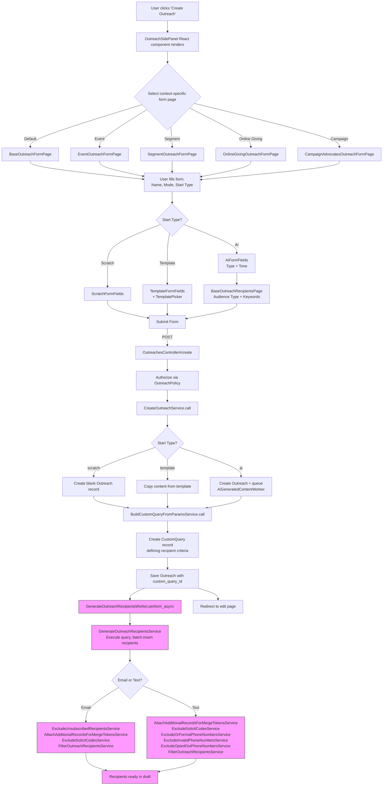

## Overview

An Outreach is a communication (email or SMS) sent to a targeted group of recipients. Creating an outreach involves selecting a communication mode, choosing a starting point (scratch, template, or AI-generated), defining the target audience, and generating an initial recipient list. The outreach is created in `draft` state and the user is redirected to the editor to compose content before sending.

Outreach uses **Single Table Inheritance (STI)**: the base `Outreach` model has two subclasses - `Outreach::Email` and `Outreach::Text`.

---

## Flowchart: Decision Points & Branching



> Pink nodes indicate **asynchronous background processing** (Sidekiq). The user is redirected to the edit page immediately while recipients are generated in the background.

---

## Sequence Diagram: Component Interactions

```mermaid
sequenceDiagram
    actor User
    participant FE as React Frontend<br/>(OutreachSidePanel)
    participant Ctrl as OutreachesController
    participant Auth as OutreachPolicy
    participant Svc as CreateOutreachService
    participant QSvc as BuildCustomQuery<br/>FromParamsService
    participant DB as Database
    participant Sidekiq as Sidekiq
    participant GenW as GenerateOutreach<br/>RecipientsWorker

    User->>FE: Click "Create Outreach"
    FE->>FE: Render context-specific form page
    User->>FE: Fill form (name, mode, start type)

    alt Start Type = AI
        User->>FE: Configure AI options (type, tone)
        FE->>FE: Navigate to RecipientsPage
        User->>FE: Select audience type + keywords
    end

    User->>FE: Submit form
    FE->>Ctrl: POST /schools/:id/admin/outreach

    Ctrl->>Auth: authorize(outreach, create_policy_method)
    Auth-->>Ctrl: Authorized

    Ctrl->>Svc: CreateOutreachService.call(params)

    alt Scratch
        Svc->>DB: Outreach.create!(state: draft)
    else Template
        Svc->>DB: Copy template content + create Outreach
    else AI
        Svc->>DB: Outreach.create!(state: draft)
        Svc->>Sidekiq: AiGeneratedContentWorker.perform_async
    end

    Svc-->>Ctrl: outreach

    Ctrl->>QSvc: BuildCustomQueryFromParamsService.call(params)
    QSvc->>DB: CustomQuery.create!(data)
    QSvc-->>Ctrl: custom_query_id

    Ctrl->>DB: outreach.update!(custom_query_id)
    Ctrl->>Sidekiq: GenerateOutreachRecipientsWorker.perform_async(outreach.id)
    Ctrl-->>User: Redirect to edit page

    Note over Sidekiq,DB: Async (user does not wait)

    Sidekiq->>GenW: Execute
    GenW->>DB: Execute CustomQuery, fetch matching records
    GenW->>DB: Batch insert OutreachRecipient records

    alt Email Outreach
        GenW->>DB: Exclude unsubscribed
        GenW->>DB: Attach merge token records
        GenW->>DB: Exclude solicit codes
        GenW->>DB: Apply filters
    else Text Outreach
        GenW->>DB: Attach merge token records
        GenW->>DB: Exclude solicit codes
        GenW->>DB: Exclude/format phone numbers
        GenW->>DB: Exclude invalid phones
        GenW->>DB: Exclude opted-out phones
        GenW->>DB: Apply filters
    end

    GenW-->>Sidekiq: Complete

    click FE href "#" "app/javascript/react_frontend/outreach/NewOutreach/OutreachSidePanel.jsx:11-57"
    click Ctrl href "#" "app/controllers/categories/admin/outreaches_controller.rb:76-119"
    click Auth href "#" "app/policies/outreach_policy.rb:31-44"
    click Svc href "#" "app/services/outreaches/create_outreach_service.rb:20-36"
    click QSvc href "#" "app/services/outreaches/build_custom_query_from_params_service.rb:20-75"
    click GenW href "#" "app/workers/outreaches/generate_outreach_recipients_worker.rb:10-30"
```

---

## Routes & Controller Actions

### Primary Creation Routes

| Method | Path | Controller#Action | Purpose |
|--------|------|-------------------|---------|
| `POST` | `/schools/:school_id/admin/outreach` | `Categories::Admin::OutreachesController#create` | Create a new outreach (standard flow) |
| `GET` | `/donor-outreach-ai/` | Redirects to `outreaches/new` | Entry point for AI outreach tool |
| `GET` | `/donor-outreach-ai/outreaches/new` | `DonorOutreachAi::OutreachesController#new` | AI outreach creation form |
| `POST` | `/donor-outreach-ai/outreaches` | `DonorOutreachAi::OutreachesController#create` | Create AI-generated outreach |

### Related Routes (used during creation)

| Method | Path | Controller#Action | Purpose |
|--------|------|-------------------|---------|
| `POST` | `/schools/:school_id/admin/outreach/email_templates/:id/create_outreach` | `Outreach::EmailTemplatesController#create_outreach` | Create outreach from a template |
| `GET` | `/schools/:school_id/admin/outreach/email_templates` | `Outreach::EmailTemplatesController#index` | List available templates |
| `GET` | `/schools/:school_id/admin/outreach/email_templates/:id/preview` | `Outreach::EmailTemplatesController#preview` | Preview a template |

### Controller Filters (OutreachesController)

- `before_action :check_if_feature_enabled?` - Verifies outreach feature is enabled for the school
- `before_action :set_outreach` - Loads outreach record (except on create/index)
- `skip_before_action :admin_view` - Bypasses standard admin layout
- `skip_before_action :school_partnered` - Allows non-partnered schools

---

## Performance Bottlenecks

### 1. Recipient Generation (Critical - 5 min SLA, 15 min alert threshold)

**Location:** `GenerateOutreachRecipientsWorker` / `GenerateOutreachRecipientsService`

The recipient generation pipeline executes a `CustomQuery` against the database, which can return thousands of records. The pipeline then runs multiple filtering services sequentially. A Sentry alert fires if this exceeds 15 minutes.

**Mitigation:** Batch inserts, benchmarked stages, concurrency locks (`sidekiq_options lock: :until_executed`).

**Risk factors:**
- Schools with very large constituent databases
- Complex custom queries with multiple join conditions
- Multiple filtering services running sequentially (especially for Text outreaches which have more filtering steps)

### 2. CustomQuery Execution

**Location:** `BuildCustomQueryFromParamsService` / `CustomQuery` model

The custom query defines the recipient audience. Complex segment queries or queries spanning multiple data sources (events, donations, campaigns) can be expensive.

**Risk factors:**
- Queries across multiple tables (events + donations + constituents)
- Lack of proper indexes on filtering columns

### 3. AI Content Generation

**Location:** `AiGeneratedContentWorker` (queued asynchronously)

When using the AI start type, content generation is offloaded to a background worker. This adds latency to the creation flow since the user must wait for AI to generate the email content.

### 4. Template Copying with Attachments

**Location:** `CreateOutreachFromTemplateService`

Copying templates with large ActiveStorage attachments can be slow due to blob duplication.

---

## Relevant Files

### Models
| File | Description |
|------|-------------|
| `app/models/outreach.rb` | Base model (STI). State machine, associations, merge token extraction |
| `app/models/outreach/email.rb` | Email-specific validations, attachments, sender defaults |
| `app/models/outreach/text.rb` | Text/SMS-specific validations, opt-out content, media |
| `app/models/outreach_recipient.rb` | Individual recipient with state (pending/sent/failed/excluded) |
| `app/models/outreach_sequence.rb` | Event-triggered sequences (invitation, reminder, follow-up) |
| `app/models/outreach_recipient_upload.rb` | CSV upload metadata and validation |
| `app/models/custom_query.rb` | Defines the recipient query criteria |

### Controllers
| File | Description |
|------|-------------|
| `app/controllers/categories/admin/outreaches_controller.rb` | Main controller - `create` action orchestrates the workflow |
| `app/controllers/donor_outreach_ai/outreaches_controller.rb` | AI-specific outreach creation |
| `app/controllers/categories/admin/outreach/email_templates_controller.rb` | Template management and create-from-template |

### Services
| File | Description |
|------|-------------|
| `app/services/outreaches/create_outreach_service.rb` | Orchestrates creation: scratch, template, or AI paths |
| `app/services/outreaches/build_custom_query_from_params_service.rb` | Translates UI filter params into a CustomQuery record |
| `app/services/outreaches/generate_outreach_recipients_service.rb` | Executes query, batch-inserts OutreachRecipient records |
| `app/services/outreaches/create_outreach_from_template_service.rb` | Copies template content into new outreach |
| `app/services/outreaches/filter_outreach_recipients_service.rb` | Applies additional recipient filters |
| `app/services/outreaches/exclude_unsubscribed_recipients_service.rb` | Removes unsubscribed recipients (email only) |
| `app/services/outreaches/exclude_solicit_codes_service.rb` | Excludes recipients by solicit codes |

### Workers (Background Jobs)
| File | Description |
|------|-------------|
| `app/workers/outreaches/generate_outreach_recipients_worker.rb` | Async recipient generation pipeline (5 min SLA) |
| `app/workers/load_outreach_recipient_upload_worker.rb` | Processes CSV recipient uploads in 1,000-row batches |

### Frontend (React)
| File | Description |
|------|-------------|
| `app/javascript/react_frontend/outreach/NewOutreach/NewOutreach.jsx` | Root component wrapping context provider |
| `app/javascript/react_frontend/outreach/NewOutreach/OutreachSidePanelContext.jsx` | Form state management across all steps |
| `app/javascript/react_frontend/outreach/NewOutreach/OutreachSidePanel.jsx` | Routes to context-specific form pages |
| `app/javascript/react_frontend/outreach/NewOutreach/pages/BaseOutreachFormPage/BaseOutreachFormPage.jsx` | Main creation form (name, mode, start type) |
| `app/javascript/react_frontend/outreach/NewOutreach/pages/BaseOutreachRecipientsPage.jsx` | AI-flow recipient selection (step 2) |
| `app/javascript/react_frontend/outreach/NewOutreach/components/OutreachMode.jsx` | Email/Text toggle |
| `app/javascript/react_frontend/outreach/NewOutreach/components/OutreachStartType.jsx` | Scratch/Template/AI selector |
| `app/javascript/react_frontend/outreach/NewOutreach/components/TemplatePicker.jsx` | Template browser |

### Views
| File | Description |
|------|-------------|
| `app/views/layouts/schools/admin/_outreach_side_panel.html.slim` | Renders NewOutreach React component inside a Rails form |
| `app/views/categories/admin/outreaches/edit.html.slim` | Editor view (redirected to after creation) |

### Policies
| File | Description |
|------|-------------|
| `app/policies/outreach_policy.rb` | Pundit policy - `create?` checks outreach permissions |
| `app/policies/outreach_template_policy.rb` | Template access control |

### Tests
| File | Description |
|------|-------------|
| `spec/requests/categories/admin/outreaches_controller_spec.rb` | Controller request specs |
| `spec/models/outreach_spec.rb` | Model validations and behavior |
| `spec/policies/outreach_policy_spec.rb` | Authorization specs |
| `spec/services/outreaches/create_outreach_service_spec.rb` | Service specs |

---

## Additional Notes for New Engineers

### State Machine
Outreaches follow this state lifecycle: `draft` -> `scheduled` -> `queued` -> `sending` -> `sent`. At creation time, the outreach is always set to `draft`. The states `partially_sent` and `failed` are error recovery states that allow retrying.

Key state groups:
- **Editable:** `draft`, `scheduled`
- **Enqueueable (can send):** `draft`, `scheduled`, `partially_sent`, `failed`
- **Sendable (worker can process):** `queued`, `partially_sent`, `failed`

### Three Creation Paths
1. **Scratch** - Creates a blank outreach. User composes content manually in the editor.
2. **Template** - Copies subject, content, sender info, and attachments from an existing `Outreach::EmailTemplate`.
3. **AI** - Creates a blank outreach and enqueues `AiGeneratedContentWorker` to generate content based on type (Update, Thank, Appeal, Invitation) and tone.

### Authorization Model
Uses Pundit. Key permissions for creation:
- `outreach_manage` - Full access to all outreach operations
- `outreach_create_event_outreaches` - Limited to event-based outreaches
- `outreach_create_campaign_outreach` - Limited to campaign-based outreaches

The controller dynamically selects the policy method based on context (e.g., event vs campaign).

### Recipient Generation is Async
After creation, `GenerateOutreachRecipientsWorker` runs in the background. The user sees the edit page immediately, and recipients populate asynchronously. The frontend polls or uses websockets to show recipient count updates.

### Concurrency Protection
Several workers use Sidekiq concurrency locks (`lock: :until_executed`) to prevent duplicate processing of the same outreach. This is important because users may trigger actions multiple times or scheduled jobs may overlap.

### CustomQuery System
Recipients are defined via a `CustomQuery` record, not stored directly. This allows re-executing the query at send time to get the latest matching constituents. The query supports many audience types: event registrations, segments, donors, advocates, campaign participants, and more.
