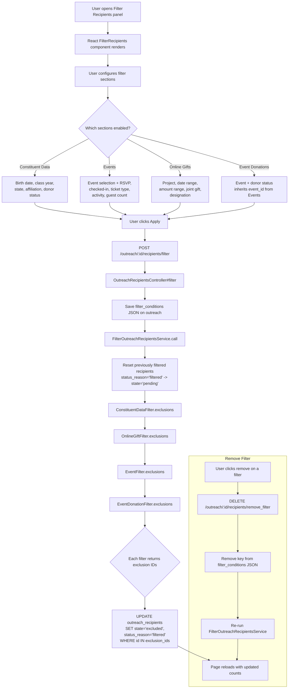

## Overview

After recipients are generated for an outreach, admins can apply **filters** to exclude recipients matching specific criteria. Filters are stored as JSON in `outreach.filter_conditions` and applied by `FilterOutreachRecipientsService`. Filtered recipients are marked with `state: "excluded"` and `status_reason: "filtered"`, distinguishing them from other exclusion types (unsubscribed, solicit codes, invalid email, etc.).

There are four filter types:
- **Constituent Data** - Class year, birth date, US state, school affiliation, donor status
- **Events** - Event attendance, RSVP state, ticket type, activity, guest count
- **Online Gifts** - Campaign/project, date range, amount range, joint gift, designation
- **Event Donations** - Event-specific donor status (has donated / has not donated)

Each filter supports a `negate` option that inverts the logic -- instead of excluding matching recipients, it includes only those who match (excluding everyone else).

---

## Flowchart: Decision Points & Branching



---

## Sequence Diagram: Component Interactions

```mermaid
sequenceDiagram
    actor User
    participant FE as React FilterRecipients<br/>(Side Panel)
    participant Ctrl as OutreachRecipientsController
    participant Auth as OutreachRecipientPolicy
    participant DB as Database
    participant Svc as FilterOutreachRecipientsService
    participant CDF as ConstituentDataFilter
    participant EF as EventFilter
    participant OGF as OnlineGiftFilter
    participant EDF as EventDonationFilter

    User->>FE: Open filter panel
    FE->>FE: Load initialState from existing filter_conditions
    User->>FE: Configure filters (toggle sections, set values)
    User->>FE: Click Apply

    FE->>FE: deepDropEmptyKeys(state)
    FE->>FE: snakecaseKeys(filter)
    FE->>Ctrl: POST /outreach/:id/recipients/filter (JSON)

    Ctrl->>Auth: authorize (can_manage_recipients?)
    Auth-->>Ctrl: Authorized
    Ctrl->>DB: outreach.update!(filter_conditions: params)
    Ctrl->>Svc: FilterOutreachRecipientsService.call(outreach)

    Svc->>DB: Reset: UPDATE outreach_recipients<br/>SET state='pending', status_reason=NULL<br/>WHERE status_reason='filtered'

    Svc->>CDF: ConstituentDataFilter.new(base, conditions).exclusions
    Note over CDF: Joins: person_crm_data, people,<br/>donor_statuses, addresses, affiliations
    CDF-->>Svc: Array of exclusion subqueries

    Svc->>DB: UPDATE SET state='excluded', status_reason='filtered'<br/>WHERE id IN (constituent data exclusions)

    Svc->>OGF: OnlineGiftFilter.new(base, conditions).exclusions
    Note over OGF: Joins: contributions, designations
    OGF-->>Svc: Array of exclusion subqueries

    Svc->>DB: UPDATE SET state='excluded', status_reason='filtered'<br/>WHERE id IN (online gift exclusions)

    Svc->>EF: EventFilter.new(base, conditions).exclusions
    Note over EF: Joins: event_attendees, event_registrations,<br/>event_tickets, event_ticket_types
    EF-->>Svc: Array of exclusion subqueries

    Svc->>DB: UPDATE SET state='excluded', status_reason='filtered'<br/>WHERE id IN (event exclusions)

    Svc->>EDF: EventDonationFilter.new(base, conditions).exclusions
    Note over EDF: Joins: contributions via event context
    EDF-->>Svc: Array of exclusion subqueries

    Svc->>DB: UPDATE SET state='excluded', status_reason='filtered'<br/>WHERE id IN (event donation exclusions)

    Svc-->>Ctrl: Complete
    Ctrl-->>User: 200 OK, page reloads

    click FE href "#" "app/javascript/react_frontend/categories/admin/outreach_side_panel/filter_recipients/index.jsx:8-23"
    click Ctrl href "#" "app/controllers/categories/admin/outreach_recipients_controller.rb:91-102"
    click Auth href "#" "app/policies/outreach_recipient_policy.rb:46-48"
    click Svc href "#" "app/services/outreaches/filter_outreach_recipients_service.rb:8-30"
    click CDF href "#" "app/services/outreaches/filters/constituent_data_filter.rb:15-24"
    click EF href "#" "app/services/outreaches/filters/event_filter.rb:17-26"
    click OGF href "#" "app/services/outreaches/filters/online_gift_filter.rb:16-25"
    click EDF href "#" "app/services/outreaches/filters/event_donation_filter.rb:10-19"
```

---

## Routes & Controller Actions

### Filter Routes

| Method | Path | Controller#Action | Purpose |
|--------|------|-------------------|---------|
| `POST` | `/outreach/:outreach_id/recipients/filter` | `OutreachRecipientsController#filter` | Apply filter conditions |
| `DELETE` | `/outreach/:outreach_id/recipients/remove_filter` | `OutreachRecipientsController#remove_filter` | Remove a specific filter key |
| `DELETE` | `/outreach/:outreach_id/recipients/destroy_all` | `OutreachRecipientsController#destroy_all` | Clear all recipients and filters |

### Controller Filter Parameters

The `filter` action accepts this nested structure:

```ruby
params.require(:filter).permit(
  constituent_data: ConstituentDataFilter.get_params,
  events: EventFilter.get_params,
  online_gifts: OnlineGiftFilter.get_params,
  event_donations: EventDonationFilter.get_params
)
```

---

## Performance Bottlenecks

### 1. Complex Arel Joins per Filter

**Location:** Each filter class (`ConstituentDataFilter`, `EventFilter`, `OnlineGiftFilter`, `EventDonationFilter`)

Each filter builds Arel queries with multiple table joins. The `EventFilter` is the most complex, joining `event_attendees`, `event_registrations`, `event_tickets`, `event_ticket_types`, and optionally `event_activities` with subqueries for guest counts.

**Risk factors:**
- Filters are applied sequentially (not parallelized)
- Each filter executes a separate UPDATE query
- Large outreaches with many recipients amplify the cost of each join

### 2. Reset Before Re-apply

**Location:** `FilterOutreachRecipientsService#reset_state`

Every time filters are applied, all previously filtered recipients are reset to `pending` first, then all filters are re-applied from scratch. This means modifying a single filter condition triggers a full reset + re-apply of all filters.

### 3. Event Filter Subqueries

**Location:** `EventFilter` builds multiple Arel subqueries

The event filter creates aliased subqueries for ticket data, activity tickets, and guest counts. For events with many attendees and ticket types, these subqueries can be expensive.

---

## Relevant Files

### Services
| File | Description |
|------|-------------|
| `app/services/outreaches/filter_outreach_recipients_service.rb` | Orchestrator: resets filtered recipients, applies all four filter types |
| `app/services/outreaches/filters/base_filter.rb` | Base class: param parsing, Arel table setup, negation support, exclusion query building |
| `app/services/outreaches/filters/constituent_data_filter.rb` | Filters by birth date, class year, US state, school affiliation, donor status |
| `app/services/outreaches/filters/event_filter.rb` | Filters by event attendance, RSVP, ticket type, activity, guest count (requires event_id) |
| `app/services/outreaches/filters/online_gift_filter.rb` | Filters by campaign/project, donation date/amount, joint gift, designation |
| `app/services/outreaches/filters/event_donation_filter.rb` | Filters by event donor status: has_donated / has_not_donated (requires event_id) |

### Controllers
| File | Description |
|------|-------------|
| `app/controllers/categories/admin/outreach_recipients_controller.rb` | `filter`, `remove_filter`, `destroy_all` actions |

### Frontend (React)
| File | Description |
|------|-------------|
| `app/javascript/react_frontend/categories/admin/outreach_side_panel/filter_recipients/index.jsx` | Root component: wraps DataProvider + StoreProvider + Form |
| `app/javascript/react_frontend/categories/admin/outreach_side_panel/filter_recipients/components/Form.jsx` | Handles submission: deepDropEmptyKeys, snakecaseKeys, POST to filter endpoint |
| `app/javascript/react_frontend/categories/admin/outreach_side_panel/filter_recipients/components/Store.jsx` | Context-based state management for filter form |
| `app/javascript/react_frontend/categories/admin/outreach_side_panel/filter_recipients/components/Reducer.js` | Reducer actions: TOGGLE_INCLUDE_SECTION, SET_FIELD, SET_SUBFIELD, etc. |
| `app/javascript/react_frontend/categories/admin/outreach_side_panel/filter_recipients/pages/ConstituentData.jsx` | Constituent data filter UI |
| `app/javascript/react_frontend/categories/admin/outreach_side_panel/filter_recipients/pages/Events.jsx` | Event filter UI (auto-clears EventDonations when toggled off) |
| `app/javascript/react_frontend/categories/admin/outreach_side_panel/filter_recipients/pages/OnlineGifts.jsx` | Online gifts filter UI |

### Models
| File | Description |
|------|-------------|
| `app/models/outreach.rb` | `filter_conditions` JSONB column (default: `{}`) |
| `app/models/outreach_recipient.rb` | State machine: `excluded` state with `status_reason: "filtered"` |

### Policies
| File | Description |
|------|-------------|
| `app/policies/outreach_recipient_policy.rb` | `can_manage_recipients?` authorization |

---

## Additional Notes for New Engineers

### filter_conditions JSON Structure

Stored as JSONB on the `outreaches` table. Each section is optional:

```json
{
  "constituent_data": {
    "class_year": 2020,
    "birth_date": { "low": "1990-01-01", "high": "2000-01-01" },
    "us_state_id": 5,
    "school_affiliation_id": 12,
    "donor_status_configuration_id": 3,
    "negate": false
  },
  "events": {
    "event_id": 123,
    "rsvp_state": "attending",
    "checked_in": true,
    "event_ticket_type_id": 456,
    "event_activity_id": 789,
    "guest_count": { "low": 1, "high": 5 },
    "offline": false,
    "integrated_donations": "true",
    "negate": false
  },
  "online_gifts": {
    "project_id": 100,
    "value": { "low": 50, "high": 5000 },
    "created_at": { "low": "2024-01-01", "high": "2024-12-31" },
    "joint_gift": true,
    "designation_id": 42,
    "negate": true
  },
  "event_donations": {
    "event_id": 123,
    "donor_status": "has_donated",
    "negate": false
  }
}
```

### Negation Logic

Each filter section has a `negate` boolean:
- `negate: false` (default) - **Exclude** recipients matching the criteria
- `negate: true` - **Include only** recipients matching the criteria (exclude everyone else)

Implementation: when negated, the filter inverts the query by collecting matching IDs and then selecting all recipients NOT in that set.

### Filter Execution Order

Filters are applied sequentially in this order:
1. ConstituentDataFilter
2. OnlineGiftFilter
3. EventFilter
4. EventDonationFilter

Each filter independently generates exclusion IDs and executes its own UPDATE statement. A recipient excluded by one filter won't be re-evaluated by subsequent filters (the base query excludes already-excluded recipients).

### Reset-Then-Apply Pattern

`FilterOutreachRecipientsService` always:
1. Resets all recipients with `status_reason: "filtered"` back to `pending`
2. Re-applies all active filters from scratch

This ensures filter changes are clean -- removing a filter condition properly re-includes previously filtered recipients.

### Filtering vs. Other Exclusions

| Exclusion Type | status_reason | When Applied | Re-applied on Filter Change? |
|---|---|---|---|
| User-defined filters | `"filtered"` | `FilterOutreachRecipientsService` | Yes (reset + re-apply) |
| Unsubscribed | `"unsubscribed"` | `ExcludeUnsubscribedRecipientsService` | No |
| Solicit codes | `"Solicit Code: {name}"` | `ExcludeSolicitCodesService` | No |
| Invalid email | `"Invalid email address"` | `GenerateOutreachRecipientsService` | No |
| Invalid phone | `"Invalid phone number"` | `ExcludeInvalidPhoneNumbersService` | No |
| Opted out (text) | `"Opted out"` | `ExcludeOptedOutPhoneNumbersService` | No |
| Duplicate email | `"Duplicate email address..."` | `SendOutreachWorker` (at send time) | No |

### Filters in the Generation Pipeline

When recipients are regenerated (via refresh or at send time), `FilterOutreachRecipientsService` is the **last step** in the pipeline. This means:
1. Recipients are generated from the custom query
2. System exclusions run first (unsubscribed, solicit codes, phone validation)
3. User-defined filters run last

This ordering ensures system-level exclusions take precedence and that filters only operate on otherwise-valid recipients.

### EventDonations Depends on Events

The `EventDonationFilter` requires an `event_id`, which is automatically copied from the `Events` filter section by the frontend Form component. Toggling off Events also clears EventDonations.
