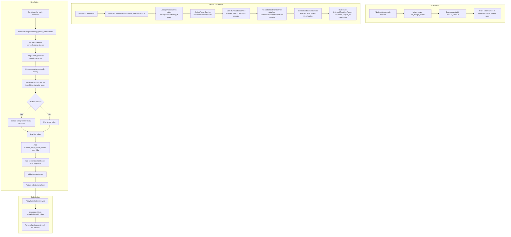

## Overview

The merge token system enables personalized outreach communications by replacing placeholders (e.g., `$Const_First_Name$`) with recipient-specific values at send time. The system has three layers:

1. **Recipient Records** - Polymorphic associations linking each `OutreachRecipient` to data sources (Person, PersonCrmDatum, Contribution, EventRegistration, etc.) via `OutreachRecipientRecord`
2. **Token Extraction** - A `before_save` callback scans email/text content for tokens matching `$Token_Name$` or `$Token_Name[argument]$` and stores them on the outreach
3. **Token Resolution** - At send time, each recipient's tokens are resolved by generator classes that query the recipient's associated records, with priority ordering when multiple data sources exist

Additionally, **custom merge tokens** from CSV uploads are stored separately in `OutreachRecipientCustomMergeToken` and merged into the substitution map.

---

## Flowchart: Token Lifecycle



---

## Sequence Diagram: Component Interactions

### Record Attachment (during recipient generation)

```mermaid
sequenceDiagram
    participant GenW as GenerateOutreach<br/>RecipientsWorker
    participant Svc as AttachAdditional<br/>RecordsService
    participant Lookup as LookupPersonService
    participant CP as CollectPersonService
    participant CC as CollectCrmDatumService
    participant CU as CollectUploadRowService
    participant CCo as CollectContributionService
    participant DB as Database

    GenW->>Svc: AttachAdditionalRecordsForMergeTokensService.call(outreach)
    Svc->>DB: Load included recipients with existing records

    Svc->>Lookup: LookupPersonService.new(outreach)
    Lookup->>DB: Build person_ids_by_email map (primary EmailAddress records)
    Lookup->>DB: Build person_ids_by_phone map (cell phones)
    Lookup->>DB: Build person_ids_by_external_id map (unique identifiers)

    Svc->>CP: CollectPersonService.call(lookup, recipients)
    loop Each recipient
        CP->>Lookup: person_ids_for_recipient(recipient)
        CP->>CP: Skip if Person already attached
        CP->>CP: Build insert hash {outreach_recipient_id, uuid_record_type: "Person", uuid_record_id}
    end
    CP-->>Svc: UUID record inserts

    Svc->>CC: CollectCrmDatumService.call(lookup, recipients, school)
    CC->>DB: Fetch latest PersonCrmDatum by email (ordered by created_at DESC)
    loop Each recipient
        CC->>CC: Match by email or person_id
        CC->>CC: Build insert hash for PersonCrmDatum
    end
    CC-->>Svc: UUID record inserts

    Svc->>CU: CollectUploadRowService.call(outreach, recipients)
    CU->>DB: Fetch upload rows for this outreach's uploads
    loop Each recipient
        CU->>CU: Match by email
        CU->>CU: Build insert hash for OutreachRecipientUploadRow
    end
    CU-->>Svc: UUID record inserts

    Svc->>CCo: CollectContributionService.call(school, lookup, recipients)
    CCo->>DB: Fetch latest authorized/paid contributions by email
    CCo->>DB: Fetch contributions by person_id via PersonRecord
    loop Each recipient
        CCo->>CCo: Find most recent contribution
        CCo->>CCo: Build insert hash for Contribution
    end
    CCo-->>Svc: Bigint record inserts

    Svc->>DB: OutreachRecipientRecord.insert_all (UUID records, 500/batch, unique_by)
    Svc->>DB: OutreachRecipientRecord.insert_all (bigint records, 500/batch, unique_by)

    click GenW href "#" "app/workers/outreaches/generate_outreach_recipients_worker.rb:10-30"
    click Svc href "#" "app/services/outreaches/attach_additional_records_for_merge_tokens_service.rb:9-25"
    click Lookup href "#" "app/services/outreaches/records/lookup_person_service.rb:6-10"
    click CP href "#" "app/services/outreaches/records/collect_person_service.rb:10-15"
    click CC href "#" "app/services/outreaches/records/collect_crm_datum_service.rb:12-17"
    click CU href "#" "app/services/outreaches/records/collect_upload_row_service.rb:11-16"
    click CCo href "#" "app/services/outreaches/records/collect_contribution_service.rb:13-18"
```

### Token Resolution (at send time)

```mermaid
sequenceDiagram
    participant Enum as RecipientEnumerator
    participant OR as OutreachRecipient
    participant MT as MergeToken (DB record)
    participant Gen as TokenGenerator
    participant CMT as CustomMergeToken
    participant Apply as ApplySubstitutionsService

    Enum->>OR: merge_token_substitutions

    OR->>OR: Initialize: all tokens -> empty string

    loop Each MergeToken in outreach.merge_token_records
        OR->>MT: token.generator(records)
        MT->>Gen: Instantiate generator class with recipient's records
        Gen->>Gen: Sort records by priority order
        Gen->>Gen: Extract values from each record
        Gen-->>OR: Array of available values

        alt Multiple values
            OR->>OR: Create MergeTokenReview record
        end

        OR->>OR: substitutions[token] = first value
    end

    OR->>CMT: custom_merge_token_values
    CMT->>CMT: Query by outreach_id + email_address + token names
    CMT-->>OR: {token => value} hash
    OR->>OR: Merge custom tokens into substitutions

    OR->>OR: Process personalization tokens (segment-based)
    OR->>OR: Process advocate tokens
    OR->>OR: Process funnel event tracking tokens

    OR-->>Enum: Complete substitutions hash

    Enum->>Apply: ApplySubstitutionsService.call(content, substitutions)
    Apply->>Apply: gsub each $token$ with its value
    Apply-->>Enum: Personalized content

    click Enum href "#" "app/lib/email_delivery/recipient_enumerator/outreach.rb:2-72"
    click OR href "#" "app/models/outreach_recipient.rb:131-175"
    click MT href "#" "app/models/merge_token.rb:1-61"
    click Gen href "#" "app/services/outreaches/merge_tokens/base_token_generator.rb:1-26"
    click CMT href "#" "app/models/outreach_recipient_custom_merge_token.rb:1-4"
    click Apply href "#" "app/lib/email_delivery/apply_substitutions_service.rb:9-13"
```

---

## Routes & Controller Actions

Merge tokens and recipient records don't have dedicated routes. They are managed implicitly through:

| Context | Route | How Records/Tokens Are Affected |
|---------|-------|---------------------------------|
| Outreach content saved | `PATCH /outreach/:id` | `set_merge_tokens` callback extracts tokens |
| Recipients generated | (via `GenerateOutreachRecipientsWorker`) | `AttachAdditionalRecordsForMergeTokensService` links records |
| Pre-compute substitutions | (via `GenerateMergeTokenSubstitutionsWorker`) | Stores all values in `MergeTokenSubstitution` table |
| Recipient sources view | `GET /outreach/:outreach_id/recipients/:id/sources` | Shows attached records and merge token values |

---

## Performance Bottlenecks

### 1. LookupPersonService Initialization

**Location:** `Outreaches::Records::LookupPersonService`

On initialization, this service builds three lookup maps by querying the school's `email_addresses`, `individuals` (for phones), and `individuals` (for external IDs). For schools with hundreds of thousands of constituents, these queries are expensive and the resulting hashes consume significant memory.

### 2. Per-Recipient Token Resolution

**Location:** `OutreachRecipient#merge_token_substitutions`

Each recipient's tokens are resolved individually at send time. For outreaches with many merge tokens and many recipients, the cumulative cost is significant. Each token instantiates a generator class, sorts the recipient's records by priority, and extracts values.

**Mitigation:** The `GenerateMergeTokenSubstitutionsService` can pre-compute all values in batches of 1,000 and store them in the `MergeTokenSubstitution` table.

### 3. Collect Services with Large Datasets

**Location:** `CollectContributionService`, `CollectCrmDatumService`

These services pre-fetch all contributions or CRM data for the school into in-memory hashes. For schools with many donations or CRM records, this can consume significant memory.

### 4. Bulk Insert Volume

**Location:** `AttachAdditionalRecordsForMergeTokensService#bulk_insert_new_records_for_merge_tokens!`

For outreaches with many recipients and many record types, the total number of `OutreachRecipientRecord` inserts can be very large (recipients x record types). Inserts are batched at 500 rows, but the total volume can still be high.

---

## Relevant Files

### Models - Record Association
| File | Description |
|------|-------------|
| `app/models/outreach_recipient_record.rb` | Polymorphic join: links recipients to data records (dual UUID/bigint support) |
| `app/models/concerns/dual_type_polymorphic_associations.rb` | Concern enabling both UUID and bigint polymorphic associations on one model |
| `app/models/outreach_recipient.rb` | `merge_token_substitutions` method: resolves all tokens for a recipient |

### Models - Token System
| File | Description |
|------|-------------|
| `app/models/merge_token.rb` | Token registry: maps token names to generator classes |
| `app/models/outreach.rb` | `TOKEN_REGEX`, `set_merge_tokens` callback, `merge_token_records`, `merge_token_names` |
| `app/models/outreach/email.rb` | Extracts tokens from `email_content` and `subject` |
| `app/models/outreach/text.rb` | Extracts tokens from `message` and `opt_out_content` |
| `app/models/outreach_recipient_custom_merge_token.rb` | Custom token values from CSV uploads (keyed by outreach + email + token) |
| `app/models/outreach_recipient_merge_token_review.rb` | Tracks recipients with multiple possible values for admin review |
| `app/models/merge_token_substitution.rb` | Pre-computed token values (for batch generation) |
| `app/models/merge_token_substitution_batch.rb` | Batch tracking for pre-computation (state: pending/done/failed) |

### Services - Record Collection
| File | Description |
|------|-------------|
| `app/services/outreaches/attach_additional_records_for_merge_tokens_service.rb` | Orchestrator: calls all collect services, bulk inserts results |
| `app/services/outreaches/records/lookup_person_service.rb` | Builds lookup maps: person_ids by email, phone, and external_id |
| `app/services/outreaches/records/collect_person_service.rb` | Finds and attaches Person records via LookupPersonService |
| `app/services/outreaches/records/collect_crm_datum_service.rb` | Finds most recent PersonCrmDatum by email or person_id |
| `app/services/outreaches/records/collect_upload_row_service.rb` | Finds OutreachRecipientUploadRow by email for this outreach's uploads |
| `app/services/outreaches/records/collect_contribution_service.rb` | Finds most recent authorized/paid Contribution by email or person_id |

### Services - Token Generation
| File | Description |
|------|-------------|
| `app/services/outreaches/merge_tokens/base_token_generator.rb` | Base class: record sorting by priority, value extraction pattern |
| `app/services/outreaches/merge_tokens/constituent_first_name_token_generator.rb` | `$Const_First_Name$`: PersonCrmDatum > UploadRow > SegmentMember |
| `app/services/outreaches/merge_tokens/constituent_last_name_token_generator.rb` | `$Const_Last_Name$`: PersonCrmDatum > UploadRow > SegmentMember |
| `app/services/outreaches/merge_tokens/constituent_address_token_generator.rb` | `$Const_Address$`: from Person record |
| `app/services/outreaches/merge_tokens/donor_name_token_generator.rb` | `$Donor_Name$`: from Contribution payer_name |
| `app/services/outreaches/merge_tokens/last_donation_amount_token_generator.rb` | `$Last_Donation_Amount$`: formatted currency from Contribution |
| `app/services/outreaches/merge_tokens/last_gift_date_token_generator.rb` | `$Last_Gift_Date$`: MM/DD/YYYY from Contribution |
| `app/services/outreaches/merge_tokens/last_gift_designation_token_generator.rb` | `$Last_Gift_Designation$`: designation name(s) from Contribution |
| `app/services/outreaches/merge_tokens/donor_and_joint_name_token_generator.rb` | `$Donor_and_Joint_Name$`: payer + joint donor name |
| `app/services/outreaches/merge_tokens/spouse_first_name_token_generator.rb` | `$Spouse_First_Name$`: from Person or PersonCrmDatum |

### Services - Substitution
| File | Description |
|------|-------------|
| `app/services/outreaches/generate_merge_token_substitutions_service.rb` | Pre-computes all substitutions in batches of 1,000 |
| `app/lib/email_delivery/apply_substitutions_service.rb` | Final step: gsub each `$token$` with its resolved value |

### Workers
| File | Description |
|------|-------------|
| `app/workers/outreaches/generate_merge_token_substitutions_worker.rb` | Async: pre-computes merge token values (retry: 2, lock: until_executed) |

---

## Additional Notes for New Engineers

### Token Syntax

Tokens follow the pattern `$Token_Name$` or `$Token_Name[argument]$`:

```
$Const_First_Name$                    → Simple token
$Personalization_Token[ClassYear]$    → Token with argument
$Advocate_URL[campaign_123]$          → Token with ID argument
```

The regex: `TOKEN_REGEX = /(?<interpolated_token>\$(?<token>(?<token_name>[A-Za-z][^$\[\]]*_[^$\[\]]*?)(?<token_argument>\[(?<token_value>[^\]]*)\])?)?\$)/`

Named captures:
- `interpolated_token` - Full match including `$` delimiters (e.g., `$Const_First_Name$`)
- `token_name` - Just the name (e.g., `Const_First_Name`)
- `token_value` - Argument value if present (e.g., `ClassYear`)

### OutreachRecipientRecord: Dual Polymorphic Pattern

The `OutreachRecipientRecord` model uses a custom `DualTypePolymorphicAssociations` concern because some associated records use UUID primary keys and others use bigint. Each record has four columns:

```
uuid_record_type   | uuid_record_id   | bigint_record_type | bigint_record_id
-------------------|------------------|--------------------|------------------
"Person"           | "abc-123-..."    | NULL               | NULL
NULL               | NULL             | "Contribution"     | 12345
```

The transparent `record` accessor returns whichever one is set.

### Generator Priority System

Each generator defines a `record_priority_order` array. When a recipient has multiple associated records, the generator:
1. Sorts records by priority index (lower index = higher priority)
2. Within the same priority, sorts by creation date (newest first)
3. Extracts values from all records in priority order
4. Returns all unique, non-nil values as an array

The substitution system uses the **first value** by default. If multiple values exist, a `MergeTokenReview` record is created for admin visibility.

### Available Merge Tokens by Category

**General:**
| Token | Generator | Primary Source |
|-------|-----------|---------------|
| `$Const_First_Name$` | ConstituentFirstNameTokenGenerator | PersonCrmDatum > UploadRow > SegmentMember |
| `$Const_Last_Name$` | ConstituentLastNameTokenGenerator | PersonCrmDatum > UploadRow > SegmentMember |
| `$Const_Address$` | ConstituentAddressTokenGenerator | Person |
| `$Donor_Name$` | DonorNameTokenGenerator | Contribution |
| `$Spouse_First_Name$` | SpouseFirstNameTokenGenerator | Person > PersonCrmDatum |

**Online Giving:**
| Token | Generator | Primary Source |
|-------|-----------|---------------|
| `$Last_Donation_Amount$` | LastDonationAmountTokenGenerator | Contribution (formatted currency) |
| `$Last_Gift_Date$` | LastGiftDateTokenGenerator | Contribution (MM/DD/YYYY) |
| `$Last_Gift_Designation$` | LastGiftDesignationTokenGenerator | Contribution |
| `$Designation(s)_and_Amounts$` | DesignationAndAmountTokenGenerator | Contribution |
| `$Donor_and_Joint_Name$` | DonorAndJointNameTokenGenerator | Contribution |
| `$Recur_Gift_Freq$` | RecurringGiftFrequencyTokenGenerator | Contribution |
| `$Recur_Gift_Installment_Amount$` | RecurringGiftInstallmentAmountTokenGenerator | Contribution |
| `$Recur_Gift_Total_Amount$` | RecurringGiftTotalAmountTokenGenerator | Contribution |

**Events:**
| Token | Generator | Primary Source |
|-------|-----------|---------------|
| `$EventRegistrant_First_Name$` | EventRegistrantFirstNameTokenGenerator | EventRegistration |
| `$EventRegistrant_Last_Name$` | EventRegistrantLastNameTokenGenerator | EventRegistration |
| `$Guest_First_Name$` | GuestFirstNameTokenGenerator | EventRegistration |
| `$Guest_Last_Name$` | GuestLastNameTokenGenerator | EventRegistration |
| `$Event_Ticket_Type(s)$` | EventTicketTypeTokenGenerator | EventRegistration / EventAttendee |

**Special (argument-based):**
| Token | Resolution | Source |
|-------|-----------|--------|
| `$Personalization_Token[tag]$` | Segment-based personalization | AutofillDatum / MaterializedPersonalizationDatum |
| `$Advocate_ID[campaign_id]$` | Advocate user ID | User lookup |
| `$Advocate_URL[campaign_id]$` | Advocate tracking URL | Generated URL |
| `$Personalized_Workflow[id]$` | Workflow-generated content | PersonalizedWorkflows::GenerateTokenService |

### Custom Merge Tokens from CSV

When a CSV is uploaded with columns prefixed by `custom_` (e.g., `custom_membership_id`, `custom_greeting`), these become custom merge tokens:

1. `LoadOutreachRecipientUploadWorker` creates `OutreachRecipientCustomMergeToken` records
2. Keyed by: `(outreach_id, email_address, token_name)`
3. At resolution time, `custom_merge_token_values` queries these records
4. Values are merged into the substitutions hash alongside standard tokens
5. Maximum 50 custom token columns per upload

### Pre-Computation vs. Just-in-Time Resolution

| Approach | When Used | Stored In |
|----------|-----------|-----------|
| Just-in-time | Default at send time | Not stored (computed per-recipient) |
| Pre-computed | Via `GenerateMergeTokenSubstitutionsWorker` | `MergeTokenSubstitution` table |

Pre-computation is optional and allows admins to review substitution values before sending. It processes recipients in batches of 1,000 and upserts into the `merge_token_substitutions` table.

### Token Resolution Timing

Per-recipient resolution is timed and logged:
```
Time elapsed for merge token generation for Outreach abc123, recipient def456: 45.2 milliseconds
```

For outreaches with many tokens and complex record lookups, this can add up significantly across thousands of recipients.
