## Overview

After an outreach is sent, the system tracks delivery and engagement metrics through **webhooks** from external providers. Email metrics arrive from **SendGrid** (delivered, opened, clicked, bounced, spam reported, unsubscribed) and text metrics arrive from **Twilio** (delivered, undelivered, read, failed). These events are processed asynchronously and stored as immutable audit records, while aggregate statistics are periodically recalculated for dashboard display.

The metrics pipeline has three layers:
1. **Event ingestion** - Webhooks received and persisted
2. **Event processing** - State updates on delivery/recipient records
3. **Aggregation** - Periodic rollup into `ReportingAggregate` for fast dashboard queries

---

## Flowchart: Decision Points & Branching

```mermaid
flowchart TD
    subgraph Email Metrics
        A[Recipient opens/clicks/bounces email] --> B[SendGrid fires webhook]
        B --> C[POST /mail_events]
        C --> D[MailEventsController#create]
        D --> E[Persist events in BackgroundWorkerDatum]
        E --> F[ProcessSendgridMailEventsWorker]
        F --> G[ProcessSendgridMailEventsService]
        G --> H[Filter by environment]
        H --> I[Find DeliveredEmail by gc_id]
        I --> J{Record found?}
        J -->|No| K[Log metric: message_not_found]
        J -->|Yes| L[Insert MailEvent record]
        L --> M[Update DeliveredEmail state<br/>with timestamp]
        M --> N{State precedence valid?}
        N -->|No regression| O[State updated]
        N -->|Would regress| P[Skip update]
    end

    subgraph Text Metrics
        Q[Recipient receives/reads text] --> R[Twilio fires webhook]
        R --> S[POST /gc/twilio/webhooks]
        S --> T[TwilioWebhooksController#create]
        T --> U[Create TwilioWebhook record]
        U --> V[ProcessTwilioWebhookWorker]
        V --> W{Event type?}
        W -->|SmsStatusUpdated| X[SmsStatusUpdatedService]
        X --> Y[Update TextMessage state]
        W -->|OnDeliveryUpdated| Z[OnDeliveryUpdatedService]
        Z --> AA[Create TextMessageEvent]
        AA --> AB[Update TextMessage state]
    end

    subgraph Aggregation
        AC[CalculateAggregateStatisticsWorker<br/>runs on schedule] --> AD{Outreach age?}
        AD -->|< 24h| AE[Recalculate every 10 min]
        AD -->|< 7d| AF[Recalculate every hour]
        AD -->|< 30d| AG[Recalculate daily]
        AE --> AH[CalculateAggregateStatisticsService]
        AF --> AH
        AG --> AH
        AH --> AI[Query DeliveredEmails / TextMessages]
        AI --> AJ[Query FunnelEvents for conversions]
        AJ --> AK[Query Unsubscribes / OptOuts]
        AK --> AL[Update ReportingAggregate record]
    end

    subgraph Display
        AL --> AM[User views sent outreach]
        AM --> AN[OutreachDecorator formats metrics]
        AN --> AO[OutreachMetricsViewer React component]
        AO --> AP[Sent, Delivered, Opened,<br/>Clicked, Bounced, Conversions]
    end

    style F fill:#f9f,stroke:#333
    style G fill:#f9f,stroke:#333
    style V fill:#f9f,stroke:#333
    click D href "#" "app/controllers/mail_events_controller.rb:4-17"
    click F href "#" "app/workers/email_delivery/process_sendgrid_mail_events_worker.rb:11-16"
    click G href "#" "app/lib/email_delivery/process_sendgrid_mail_events_service.rb:61-97"
    click T href "#" "app/controllers/gc/twilio/webhooks_controller.rb:9-24"
    click X href "#" "app/services/gc/twilio/webhooks/sms_status_updated_service.rb:24-28"
    click Z href "#" "app/services/gc/twilio/webhooks/on_delivery_updated_service.rb:53-66"
    click V href "#" "app/workers/texting/process_twilio_webhook_worker.rb:14-49"
    click AC href "#" "app/workers/outreaches/calculate_aggregate_statistics_worker.rb:19-27"
    click AH href "#" "app/services/outreaches/calculate_aggregate_statistics_service.rb:13-21"
    click AN href "#" "app/decorators/outreach_decorator.rb:99-111"
    click AO href "#" "app/javascript/react_frontend/outreach/OutreachMetricsViewer/OutreachMetricsViewer.jsx:12-121"

    style AC fill:#f9f,stroke:#333
    style AH fill:#f9f,stroke:#333
```



> Pink nodes indicate **asynchronous background processing** (Sidekiq).

---

## Sequence Diagram: Component Interactions

### Email Event Processing (SendGrid)

```mermaid
sequenceDiagram
    participant SG as SendGrid
    participant Ctrl as MailEventsController
    participant Persist as RunWorkerWith<br/>PersistentDataService
    participant Sidekiq as Sidekiq
    participant Worker as ProcessSendgrid<br/>MailEventsWorker
    participant Svc as ProcessSendgrid<br/>MailEventsService
    participant DB as Database

    SG->>Ctrl: POST /mail_events (JSON array of events)
    Ctrl->>Persist: Persist events in BackgroundWorkerDatum
    Persist->>Sidekiq: ProcessSendgridMailEventsWorker.perform_async
    Ctrl-->>SG: 200 OK (immediate response)

    Note over Sidekiq,DB: Async processing

    Sidekiq->>Worker: Execute
    Worker->>Persist: Fetch BackgroundWorkerDatum
    Worker->>Svc: ProcessSendgridMailEventsService.call(events)

    Svc->>Svc: Filter events by gc_env (only process current environment)

    loop Each event
        Svc->>Svc: Parse event (sg_message_id, email, event type, timestamp)
        Svc->>DB: Find DeliveredEmail by gc_id + gc_type

        alt DeliveredEmail found
            Svc->>DB: INSERT MailEvent (provider, email, event, response, timestamp)
            Svc->>DB: DeliveredEmail.update_all_to_state(state, timestamp)
            Note over DB: State only moves forward:<br/>pending→submitted→sent→opened→clicked
        else Not found
            Svc->>Svc: Log metric: message_not_found
        end
    end

    Worker->>Persist: Delete BackgroundWorkerDatum

    click Ctrl href "#" "app/controllers/mail_events_controller.rb:4-17"
    click Worker href "#" "app/workers/email_delivery/process_sendgrid_mail_events_worker.rb:11-16"
    click Svc href "#" "app/lib/email_delivery/process_sendgrid_mail_events_service.rb:61-97"
```

### Text Event Processing (Twilio)

```mermaid
sequenceDiagram
    participant Twilio as Twilio
    participant Ctrl as TwilioWebhooksController
    participant DB as Database
    participant Sidekiq as Sidekiq
    participant Worker as ProcessTwilio<br/>WebhookWorker
    participant Svc as OnDeliveryUpdatedService

    Twilio->>Ctrl: POST /gc/twilio/webhooks
    Ctrl->>DB: Create TwilioWebhook record
    Ctrl->>Sidekiq: ProcessTwilioWebhookWorker.perform_async
    Ctrl-->>Twilio: 200 OK

    Note over Sidekiq,DB: Async processing

    Sidekiq->>Worker: Execute
    Worker->>Worker: Route by event type

    alt OnDeliveryUpdated
        Worker->>Svc: OnDeliveryUpdatedService.call(payload)
        Svc->>DB: Find TextMessage by MessageSid
        Svc->>DB: Find TextConversationParticipant by ParticipantSid
        Svc->>DB: INSERT TextMessageEvent (status, failure_reason, timestamp)
        Svc->>DB: TextMessage.update_all_to_state(status, timestamp)
        Note over DB: Sets delivered_at on delivery
    else SmsStatusUpdated
        Worker->>DB: Find TextMessage by MessageSid
        Worker->>DB: TextMessage.update_all_to_state(MessageStatus)
    end

    click Ctrl href "#" "app/controllers/gc/twilio/webhooks_controller.rb:9-24"
    click Worker href "#" "app/workers/texting/process_twilio_webhook_worker.rb:14-49"
    click Svc href "#" "app/services/gc/twilio/webhooks/on_delivery_updated_service.rb:53-66"
```

### Metric Aggregation & Display

```mermaid
sequenceDiagram
    participant Cron as CalculateAggregate<br/>StatisticsWorker (scheduled)
    participant Svc as CalculateAggregate<br/>StatisticsService
    participant DB as Database
    actor User
    participant Ctrl as OutreachesController
    participant Dec as OutreachDecorator
    participant FE as OutreachMetricsViewer<br/>(React)

    Note over Cron: Runs on schedule based on outreach age

    Cron->>DB: Find outreaches needing recalculation
    Cron->>Svc: CalculateAggregateStatisticsService.call(outreach)

    Svc->>DB: COUNT recipients by state (total, included, excluded, failed, sent)
    Svc->>DB: COUNT delivered_emails by timestamp (bounced, delivered, opened, clicked)
    Svc->>DB: COUNT unsubscribes referred by outreach
    Svc->>DB: COUNT funnel_events (link clicks, conversions)
    Svc->>DB: UPSERT ReportingAggregate with all metrics

    User->>Ctrl: GET /outreach/:id/metrics
    Ctrl->>DB: Load outreach with reporting_aggregate (eager loaded)
    Ctrl->>Dec: outreach.decorate
    Dec->>Dec: Calculate rates (open_rate_pct, click_rate_pct, etc.)
    Dec->>Dec: Format display_full_metrics hash
    Ctrl->>FE: Render OutreachMetricsViewer with props

    FE->>FE: Display metrics cards

    opt User clicks Bounces
        User->>Ctrl: GET /outreach/:id/bounces
        Ctrl->>DB: Query bounced DeliveredEmails
        Ctrl-->>FE: JSON bounce details
    end

    opt User clicks Conversions
        User->>Ctrl: GET /outreach/:id/conversions
        Ctrl->>DB: Query FunnelEvents -> Contributions
        Ctrl-->>FE: JSON conversion details
    end

    click Cron href "#" "app/workers/outreaches/calculate_aggregate_statistics_worker.rb:19-27"
    click Svc href "#" "app/services/outreaches/calculate_aggregate_statistics_service.rb:13-21"
    click Ctrl href "#" "app/controllers/categories/admin/outreaches_controller.rb:398-409"
    click Dec href "#" "app/decorators/outreach_decorator.rb:99-111"
    click FE href "#" "app/javascript/react_frontend/outreach/OutreachMetricsViewer/OutreachMetricsViewer.jsx:12-121"
```

---

## Routes & Controller Actions

### Webhook Endpoints

| Method | Path | Controller#Action | Purpose |
|--------|------|-------------------|---------|
| `POST` | `/mail_events` | `MailEventsController#create` | SendGrid email event webhook receiver |
| `POST` | `/gc/twilio/webhooks` | `Gc::Twilio::WebhooksController#create` | Twilio SMS/conversation webhook receiver |

### Metrics Display Routes

| Method | Path | Controller#Action | Purpose |
|--------|------|-------------------|---------|
| `GET` | `/outreach/sent` | `OutreachesController#sent` | List sent outreaches with aggregate stats |
| `GET` | `/outreach/:id/metrics` | `OutreachesController#metrics` | Metrics dashboard for single outreach |
| `GET` | `/outreach/:id/bounces` | `OutreachesController#bounces` | JSON: bounced email details |
| `GET` | `/outreach/:id/conversions` | `OutreachesController#conversions` | JSON: conversion details (linked contributions) |

---

## Performance Bottlenecks

### 1. SendGrid Webhook Volume

**Location:** `MailEventsController` / `ProcessSendgridMailEventsWorker`

SendGrid sends events in batches that can contain hundreds of events per request. High-volume sends (10,000+ recipients) generate a large volume of webhook calls for opens, clicks, and delivery confirmations. Each event requires a database lookup for the corresponding `DeliveredEmail`.

**Mitigation:** Events are persisted immediately in `BackgroundWorkerDatum` (preventing data loss) and processed asynchronously. The worker has `lock: :until_executed` to prevent parallel processing of the same batch.

### 2. Aggregate Statistics Calculation

**Location:** `CalculateAggregateStatisticsService` / `CalculateAggregateStatisticsWorker`

The aggregation query joins `outreaches`, `outreach_recipients`, and `delivered_emails` tables, computing `COUNT(DISTINCT)` with multiple `FILTER` clauses. For outreaches with many recipients, this is an expensive query.

**Mitigation:** Tiered refresh schedule (10 min / hourly / daily) based on outreach age. Results are cached in the `ReportingAggregate` record. The `sent` action eager-loads `reporting_aggregate` to avoid N+1 queries.

### 3. DeliveredEmail State Updates

**Location:** `DeliveredEmail.update_all_to_state`

State updates enforce precedence (can't regress from `clicked` back to `sent`). This requires checking current state before updating, adding a conditional WHERE clause to each update.

### 4. Funnel Event Queries

**Location:** `CalculateAggregateStatisticsService` (link clicks and conversions)

Funnel events require joining through `outreach_recipients` to find events attributed to the outreach. For outreaches with many recipients and many tracked links, these queries can be slow.

---

## Relevant Files

### Webhook Controllers
| File | Description |
|------|-------------|
| `app/controllers/mail_events_controller.rb` | Receives SendGrid webhooks, persists, queues processing |
| `app/controllers/gc/twilio/webhooks_controller.rb` | Receives Twilio webhooks, creates TwilioWebhook, queues processing |

### Event Processing Services
| File | Description |
|------|-------------|
| `app/lib/email_delivery/process_sendgrid_mail_events_service.rb` | Parses SendGrid events, inserts MailEvents, updates DeliveredEmail states |
| `app/services/gc/twilio/webhooks/sms_status_updated_service.rb` | Updates TextMessage state from Twilio SMS status callback |
| `app/services/gc/twilio/webhooks/on_delivery_updated_service.rb` | Creates TextMessageEvent, updates TextMessage state from Conversations API |

### Event Processing Workers
| File | Description |
|------|-------------|
| `app/workers/email_delivery/process_sendgrid_mail_events_worker.rb` | Async: processes persisted SendGrid events (retry: 1, lock: until_executed) |
| `app/workers/texting/process_twilio_webhook_worker.rb` | Async: routes Twilio webhooks to appropriate service |

### Models - Event Storage
| File | Description |
|------|-------------|
| `app/models/delivered_email.rb` | Email delivery tracking with state machine and timestamp fields |
| `app/models/mail_event.rb` | Immutable audit trail of SendGrid events (open, click, bounce, etc.) |
| `app/models/text_message.rb` | Text message with delivery state, Twilio SID, delivered_at |
| `app/models/text_message_event.rb` | Immutable record of Twilio delivery status changes |
| `app/models/reporting_aggregate.rb` | Denormalized aggregate metrics (JSONB data column) |

### Models - Tracking
| File | Description |
|------|-------------|
| `app/models/outreach_recipient.rb` | Recipient state reflects send outcome (sent/failed/excluded) |
| `app/models/funnel_event.rb` | Tracks link clicks and conversions attributed to outreach |
| `app/models/unsubscribe.rb` | Tracks unsubscribes referred by outreach |

### Aggregation Services
| File | Description |
|------|-------------|
| `app/services/outreaches/calculate_aggregate_statistics_service.rb` | Email metrics: joins recipients + delivered_emails, counts by state/timestamp |
| `app/services/outreaches/texting/calculate_aggregate_statistics_service.rb` | Text metrics: counts delivered/undelivered messages, opt-outs |

### Aggregation Worker
| File | Description |
|------|-------------|
| `app/workers/outreaches/calculate_aggregate_statistics_worker.rb` | Scheduled: tiered recalculation (10 min / hourly / daily by outreach age) |

### Presenters & Decorators
| File | Description |
|------|-------------|
| `app/decorators/outreach_decorator.rb` | Formats metrics for display (rates, counts, display_full_metrics) |
| `app/presenters/outreaches/outreach_metrics_presenter.rb` | Bounce and conversion drill-down queries |

### Frontend (React)
| File | Description |
|------|-------------|
| `app/javascript/react_frontend/outreach/OutreachMetricsViewer/OutreachMetricsViewer.jsx` | Main metrics dashboard component |
| `app/javascript/react_frontend/outreach/OutreachMetricsViewer/BouncesDrillDown.jsx` | Bounced email list |
| `app/javascript/react_frontend/outreach/OutreachMetricsViewer/ConversionsDrillDown.jsx` | Conversion list (linked contributions) |
| `app/javascript/react_frontend/outreach/OutreachMetricsViewer/BottomRowMetric.jsx` | Individual metric card component |

### Tests
| File | Description |
|------|-------------|
| `spec/services/outreaches/calculate_aggregate_statistics_service_spec.rb` | Aggregation logic specs |
| `spec/lib/email_delivery/process_sendgrid_mail_events_service_spec.rb` | SendGrid event processing specs |
| `spec/mailers/outreaches_mailer_spec.rb` | Mailer specs (delivery tracking setup) |

---

## Additional Notes for New Engineers

### Metrics Tracked

| Metric | Email | Text | Source |
|--------|-------|------|--------|
| Recipients Total | Yes | Yes | OutreachRecipient count |
| Recipients Included | Yes | Yes | OutreachRecipient where state != excluded |
| Recipients Excluded | Yes | Yes | OutreachRecipient where state = excluded |
| Recipients Sent | Yes | Yes | OutreachRecipient where state = sent |
| Recipients Failed | Yes | Yes | OutreachRecipient where state = failed |
| Delivered | Yes | Yes | DeliveredEmail.delivered_at / TextMessage.delivered |
| Bounced | Yes | Yes | DeliveredEmail.first_bounced_at / TextMessage.undelivered |
| Opened | Yes | No | DeliveredEmail.first_opened_at |
| Clicked | Yes | No | DeliveredEmail.first_clicked_at |
| Unsubscribes | Yes | No | Unsubscribe records referred by outreach |
| Opt-outs | No | Yes | TextOptOut (STOP replies) |
| Link Clicks (GC) | Yes | Yes | FunnelEvent where action_type = link_clicked |
| Conversions | Yes | Yes | FunnelEvent where action_type in conversion types |

### Rate Calculations
- **Send rate** = num_recipients_sent / num_recipients_total
- **Open rate** = num_recipients_opened / num_recipients_total
- **Click rate** = num_recipients_clicked / num_recipients_total (email only)
- **Bounce rate** = num_recipients_bounced / num_recipients_sent
- **Unsubscribe rate** = num_referred_unsubscribes / num_recipients_total (email) or num_opt_outs / num_recipients_total (text)

### DeliveredEmail State Precedence
States can only move forward in this order:
```
pending → submitted → failed/sent → bounced/opened → clicked → unsubscribed/spam_reported/received
```
This prevents race conditions where a later "delivered" event would overwrite an earlier "opened" event. The `update_all_to_state` method enforces this with conditional SQL.

### Event Processing Guarantees
- **At-least-once delivery:** SendGrid events are persisted in `BackgroundWorkerDatum` before the webhook responds 200 OK. Twilio events are stored in `TwilioWebhook` records. This prevents data loss if the worker fails.
- **Idempotent processing:** `MailEvent` records are immutable audit logs. `DeliveredEmail` state updates are idempotent due to precedence checking.
- **Worker locking:** `ProcessSendgridMailEventsWorker` uses `lock: :until_executed` to prevent duplicate processing of the same event batch.

### Tiered Refresh Schedule
Aggregate statistics are recalculated at different frequencies based on outreach age:

| Outreach Age | Recalculation Frequency |
|---|---|
| < 24 hours | Every 10 minutes |
| < 7 days | Hourly |
| < 30 days | Daily |
| > 30 days | Manual only |

This balances metric freshness against database load.

### Funnel Events & Conversion Attribution
Click tracking and conversion attribution work through the `FunnelEvent` model. When a recipient clicks a tracked link in an outreach, a `FunnelEvent` with `action_type: "link_clicked"` is created. If that click leads to a donation or event registration, a conversion `FunnelEvent` is created, linking the outreach to the contribution.

### SendGrid Event Types
| Event | Maps to DeliveredEmail State | Description |
|-------|------------------------------|-------------|
| `processed` | (no state change) | SendGrid accepted the message |
| `delivered` | `sent` | Successfully delivered to recipient's mail server |
| `open` | `opened` | Recipient opened the email (pixel tracking) |
| `click` | `clicked` | Recipient clicked a link |
| `bounce` | `bounced` | Permanent delivery failure |
| `dropped` | `failed` | SendGrid rejected the message |
| `deferred` | `pending` | Temporary delivery delay |
| `spamreport` | `spam_reported` | Recipient marked as spam |
| `unsubscribe` | `unsubscribed` | Recipient clicked unsubscribe |
| `group_unsubscribe` | `unsubscribed` | Recipient unsubscribed from group |
| `group_resubscribe` | `opened` | Recipient resubscribed |

### Twilio Message States
| State | Description |
|-------|-------------|
| `queued` | Message queued by Twilio |
| `sending` | Twilio is sending the message |
| `sent` | Message sent to carrier |
| `delivered` | Carrier confirmed delivery |
| `undelivered` | Carrier could not deliver |
| `failed` | Message could not be sent |
| `read` | Recipient read the message (Conversations API only) |
