## Overview

Refreshing an outreach recipient list re-executes the outreach's `CustomQuery` and rebuilds the recipient list. This is a **full regeneration**, not an incremental update -- existing recipients that no longer match are soft-deleted, new matches are inserted, and the entire exclusion pipeline runs again.

Refresh is triggered in three scenarios:
1. **Manual refresh** - User clicks "Refresh" on the recipients page
2. **Source changes** - Adding or removing a recipient source triggers regeneration
3. **Send-time regeneration** - The send worker regenerates recipients immediately before delivery to capture dynamic segment changes

The process also supports **dynamic segments** -- segments whose membership is re-calculated from a query before the outreach recipients are generated.

---

## Flowchart: Decision Points & Branching

```mermaid
flowchart TD
    A{What triggered the refresh?}

    A -->|Manual refresh| B[User clicks Refresh button]
    A -->|Source added| C[User adds segment/source]
    A -->|Source removed| D[User removes a source]
    A -->|Send time| E[SendOutreachWorker starts]

    B --> F[OutreachRecipientsController#refresh]
    C --> G[OutreachRecipientsController#create]
    D --> H[OutreachRecipientsController#remove_source]
    E --> I[Worker calls .new.perform inline]

    F --> J[Set Redis: regenerating_recipients]
    G --> J
    H --> K[Destroy QueryCondition]
    K --> J

    J --> L[GenerateOutreachRecipientsWorker.perform_async]
    I --> M[GenerateOutreachRecipientsWorker.new.perform<br/>refresh_dynamic_segments=true]

    L --> N{refresh_dynamic_segments?}
    M --> N
    N -->|true| O[RefreshDependentSegmentsService]
    O --> P[Find dynamic segments in CustomQuery]
    P --> Q[RefreshDynamicSegmentsWorker<br/>for each dynamic segment]
    Q --> R[Regenerate segment members]
    R --> S[Continue to generation]
    N -->|false| S

    S --> T{Outreach type?}
    T -->|Email| U[Email Pipeline]
    T -->|Text| V[Text Pipeline]

    U --> U1[GenerateOutreachRecipientsService]
    U1 --> U2[ExcludeUnsubscribedRecipientsService]
    U2 --> U3[AttachAdditionalRecordsForMergeTokensService]
    U3 --> U4[UpdateOutreachRecipientsDataService<br/>if feature enabled]
    U4 --> U5[ExcludeSolicitCodesService]
    U5 --> U6[FilterOutreachRecipientsService]
    U6 --> W[Delete Redis key]

    V --> V1[Texting::GenerateOutreachRecipientsService]
    V1 --> V2[AttachAdditionalRecordsForMergeTokensService]
    V2 --> V3[UpdateOutreachRecipientsDataService<br/>if feature enabled]
    V3 --> V4[ExcludeSolicitCodesService]
    V4 --> V5[ExcludeOrFormatPhoneNumbersService]
    V5 --> V6[ExcludeInvalidPhoneNumbersService]
    V6 --> V7[ExcludeOptedOutPhoneNumbersService]
    V7 --> V8[FindOrCreateTextConversationsWorker]
    V8 --> V9[FilterOutreachRecipientsService]
    V9 --> W

    style L fill:#f9f,stroke:#333
    style M fill:#f9f,stroke:#333
    style O fill:#f9f,stroke:#333
    style Q fill:#f9f,stroke:#333
    style U1 fill:#f9f,stroke:#333
    style U2 fill:#f9f,stroke:#333
    style U3 fill:#f9f,stroke:#333
    style U5 fill:#f9f,stroke:#333
    style U6 fill:#f9f,stroke:#333
    style V1 fill:#f9f,stroke:#333
    style V2 fill:#f9f,stroke:#333
    style V4 fill:#f9f,stroke:#333
    style V5 fill:#f9f,stroke:#333
    style V6 fill:#f9f,stroke:#333
    style V7 fill:#f9f,stroke:#333
    style V8 fill:#f9f,stroke:#333
    click F href "#" "app/controllers/categories/admin/outreach_recipients_controller.rb:104-112"
    click G href "#" "app/controllers/categories/admin/outreach_recipients_controller.rb:29-49"
    click H href "#" "app/controllers/categories/admin/outreach_recipients_controller.rb:157-179"
    click I href "#" "app/workers/outreaches/email/send_outreach_worker.rb:24-55"
    click L href "#" "app/workers/outreaches/generate_outreach_recipients_worker.rb:10-30"
    click O href "#" "app/services/outreaches/refresh_dependent_segments_service.rb:8-12"
    click Q href "#" "app/workers/refresh_dynamic_segments_worker.rb:12-25"
    click U1 href "#" "app/services/outreaches/generate_outreach_recipients_service.rb:11-114"
    click U2 href "#" "app/services/outreaches/exclude_unsubscribed_recipients_service.rb:9-29"
    click U3 href "#" "app/services/outreaches/attach_additional_records_for_merge_tokens_service.rb:9-25"
    click U4 href "#" "app/services/outreaches/update_outreach_recipients_data_service.rb:12-20"
    click U5 href "#" "app/services/outreaches/exclude_solicit_codes_service.rb:8-21"
    click U6 href "#" "app/services/outreaches/filter_outreach_recipients_service.rb:8-30"
    click V1 href "#" "app/services/outreaches/texting/generate_outreach_recipients_service.rb:11-117"
    click V2 href "#" "app/services/outreaches/attach_additional_records_for_merge_tokens_service.rb:9-25"
    click V3 href "#" "app/services/outreaches/update_outreach_recipients_data_service.rb:12-20"
    click V4 href "#" "app/services/outreaches/exclude_solicit_codes_service.rb:8-21"
    click V5 href "#" "app/services/outreaches/texting/exclude_or_format_phone_numbers_service.rb:7-23"
    click V6 href "#" "app/services/outreaches/texting/exclude_invalid_phone_numbers_service.rb:19-30"
    click V7 href "#" "app/services/outreaches/texting/exclude_opted_out_phone_numbers_service.rb:8-17"
    click V8 href "#" "app/workers/outreaches/find_or_create_text_conversations_for_outreach_recipients_worker.rb:12-60"
    click V9 href "#" "app/services/outreaches/filter_outreach_recipients_service.rb:8-30"

    style V9 fill:#f9f,stroke:#333
```



> Pink nodes indicate **asynchronous background processing** (Sidekiq), except for send-time regeneration which runs synchronously within the send worker.

---

## Sequence Diagram: Component Interactions

### Manual Refresh

```mermaid
sequenceDiagram
    actor User
    participant Ctrl as OutreachRecipientsController
    participant Redis as Redis
    participant Sidekiq as Sidekiq
    participant GenW as GenerateOutreach<br/>RecipientsWorker
    participant RefSvc as RefreshDependent<br/>SegmentsService
    participant DynW as RefreshDynamic<br/>SegmentsWorker
    participant GenSvc as GenerateOutreach<br/>RecipientsService
    participant DB as Database
    participant Filters as Exclusion Pipeline

    User->>Ctrl: POST /outreach/:id/recipients/refresh
    Ctrl->>Redis: SET outreach_{id}_status = "regenerating_recipients" (TTL: 1h)
    Ctrl->>Sidekiq: GenerateOutreachRecipientsWorker.perform_async(id, true)
    Ctrl-->>User: Flash "Recipients refresh has been queued"

    Note over Sidekiq,DB: Async processing

    Sidekiq->>GenW: Execute(outreach_id, refresh_dynamic_segments=true)
    GenW->>DB: Find Outreach, check custom_query exists

    GenW->>RefSvc: RefreshDependentSegmentsService.call
    RefSvc->>DB: Find dynamic segments in custom_query conditions
    loop Each dynamic segment
        RefSvc->>DynW: RefreshDynamicSegmentsWorker.new.perform(segment_id)
        DynW->>DB: Regenerate segment members from segment's custom query
    end

    GenW->>GenSvc: GenerateOutreachRecipientsService.call
    GenSvc->>DB: Execute CustomQuery.fetch_mixed_records
    GenSvc->>DB: Group results by email, compare to existing recipients
    GenSvc->>DB: Soft-delete recipients no longer in query results
    GenSvc->>DB: Batch insert new recipients (5,000/batch)
    GenSvc->>DB: Create OutreachRecipientRecord associations

    GenW->>Filters: Run full exclusion pipeline
    Note over Filters: Unsubscribed -> Merge tokens -> Solicit codes -> User filters

    GenW->>Redis: DEL outreach_{id}_status

    click Ctrl href "#" "app/controllers/categories/admin/outreach_recipients_controller.rb:104-112"
    click GenW href "#" "app/workers/outreaches/generate_outreach_recipients_worker.rb:10-30"
    click RefSvc href "#" "app/services/outreaches/refresh_dependent_segments_service.rb:8-12"
    click DynW href "#" "app/workers/refresh_dynamic_segments_worker.rb:12-25"
    click GenSvc href "#" "app/services/outreaches/generate_outreach_recipients_service.rb:11-114"
```

### Send-Time Regeneration

```mermaid
sequenceDiagram
    participant SendW as SendOutreachWorker
    participant GenW as GenerateOutreach<br/>RecipientsWorker
    participant RefSvc as RefreshDependent<br/>SegmentsService
    participant GenSvc as GenerateOutreach<br/>RecipientsService
    participant DB as Database

    Note over SendW: Called synchronously (not async)

    SendW->>GenW: .new.perform(outreach_id, true)
    GenW->>RefSvc: Refresh dynamic segments
    RefSvc->>DB: Regenerate dynamic segment members

    GenW->>GenSvc: GenerateOutreachRecipientsService.call
    GenSvc->>DB: Re-execute CustomQuery
    GenSvc->>DB: Soft-delete stale recipients, insert new ones

    GenW->>DB: Run full exclusion pipeline
    GenW-->>SendW: Recipients regenerated

    SendW->>SendW: Continue with validation and delivery

    click SendW href "#" "app/workers/outreaches/email/send_outreach_worker.rb:24-55"
    click GenW href "#" "app/workers/outreaches/generate_outreach_recipients_worker.rb:10-30"
    click RefSvc href "#" "app/services/outreaches/refresh_dependent_segments_service.rb:8-12"
    click GenSvc href "#" "app/services/outreaches/generate_outreach_recipients_service.rb:11-114"
```

---

## Routes & Controller Actions

### Refresh-Related Routes

| Method | Path | Controller#Action | Purpose |
|--------|------|-------------------|---------|
| `POST` | `/outreach/:outreach_id/recipients/refresh` | `OutreachRecipientsController#refresh` | Manual refresh of recipient list |
| `POST` | `/outreach/:outreach_id/recipients` | `OutreachRecipientsController#create` | Add source (triggers regeneration) |
| `DELETE` | `/outreach/:outreach_id/recipients/remove_source` | `OutreachRecipientsController#remove_source` | Remove source (triggers regeneration) |
| `DELETE` | `/outreach/:outreach_id/recipients/destroy_all` | `OutreachRecipientsController#destroy_all` | Clear all sources, filters, and recipients |

### Controller Behaviors

- `refresh` passes `refresh_dynamic_segments=true` to the worker
- `create` passes `refresh_dynamic_segments=false` (default) -- segments aren't refreshed when just adding a new source
- `remove_source` destroys the `QueryCondition` first, then queues regeneration
- `destroy_all` does not queue regeneration -- it soft-deletes all recipients and clears all query conditions and filters

---

## Performance Bottlenecks

### 1. Full Regeneration Cost (Critical - 5 min SLA, 15 min alert)

**Location:** `GenerateOutreachRecipientsWorker`

Every refresh triggers the entire pipeline: query execution, recipient insertion, and all exclusion services. There is no incremental update path. For schools with large constituent databases and complex custom queries, this can be expensive.

**Monitoring:** Each step is individually benchmarked. If total time exceeds 15 minutes, a Sentry alert is fired.

### 2. Dynamic Segment Refresh

**Location:** `RefreshDependentSegmentsService` / `RefreshDynamicSegmentsWorker`

When `refresh_dynamic_segments=true`, each dynamic segment used in the outreach's query is fully regenerated. This happens synchronously before recipient generation, adding latency. The segment regeneration worker runs on the `:expensive` queue.

**Risk factors:**
- Multiple dynamic segments compound the delay
- Large segments with complex membership criteria
- Segment regeneration itself has no SLA monitoring

### 3. Send-Time Synchronous Regeneration

**Location:** `SendOutreachWorker` calls `GenerateOutreachRecipientsWorker.new.perform` inline

At send time, recipient generation runs synchronously within the send worker. This means the full 5-minute SLA pipeline blocks email/text delivery. A slow regeneration directly delays when recipients receive their messages.

### 4. Soft-Delete Queries for Stale Recipients

**Location:** `GenerateOutreachRecipientsService`

The service compares all existing recipient emails against query results to identify stale recipients. For outreaches with many existing recipients, building the comparison hash and executing the soft-delete UPDATE can be slow.

---

## Relevant Files

### Controllers
| File | Description |
|------|-------------|
| `app/controllers/categories/admin/outreach_recipients_controller.rb` | `refresh`, `create`, `remove_source`, `destroy_all` actions |

### Workers
| File | Description |
|------|-------------|
| `app/workers/outreaches/generate_outreach_recipients_worker.rb` | Main orchestrator: routes to email/text pipeline, benchmarks each step, manages Redis |
| `app/workers/refresh_dynamic_segments_worker.rb` | Regenerates dynamic segment members (queue: `:expensive`, no retry) |
| `app/workers/outreaches/email/send_outreach_worker.rb` | Calls generation inline before sending emails |
| `app/workers/outreaches/texting/send_outreach_worker.rb` | Calls generation inline before sending texts |

### Services - Generation
| File | Description |
|------|-------------|
| `app/services/outreaches/generate_outreach_recipients_service.rb` | Email: executes query, deduplicates by email, soft-deletes stale, batch inserts new |
| `app/services/outreaches/texting/generate_outreach_recipients_service.rb` | Text: same pattern but groups by phone number with E.164 formatting |
| `app/services/outreaches/refresh_dependent_segments_service.rb` | Finds dynamic segments in the custom query and triggers their regeneration |

### Services - Exclusion Pipeline
| File | Description |
|------|-------------|
| `app/services/outreaches/exclude_unsubscribed_recipients_service.rb` | Excludes unsubscribed emails by topic (email only) |
| `app/services/outreaches/attach_additional_records_for_merge_tokens_service.rb` | Links Person, CRM, Contribution, UploadRow records |
| `app/services/outreaches/update_outreach_recipients_data_service.rb` | Populates first_name, last_name, external_id (feature-flagged) |
| `app/services/outreaches/exclude_solicit_codes_service.rb` | Excludes recipients with suppressing solicit codes |
| `app/services/outreaches/texting/exclude_or_format_phone_numbers_service.rb` | Formats phone numbers to E.164 |
| `app/services/outreaches/texting/exclude_invalid_phone_numbers_service.rb` | Excludes invalid phone numbers |
| `app/services/outreaches/texting/exclude_opted_out_phone_numbers_service.rb` | Excludes opted-out numbers |
| `app/services/outreaches/filter_outreach_recipients_service.rb` | Applies user-defined filters (always runs last) |

### Models
| File | Description |
|------|-------------|
| `app/models/custom_query.rb` | Wraps query builder; `fetch_mixed_records` returns matching records |
| `app/models/query_condition_group.rb` | Tree node for AND/OR boolean logic across conditions |
| `app/models/query_condition.rb` | Single condition (segment, donor filter, event, etc.) |
| `app/models/segment.rb` | `refresh_policy` enum: `"static"` or `"dynamic"` |
| `app/models/outreach_recipient.rb` | Soft-deletable via `deleted_at`; state machine |

---

## Additional Notes for New Engineers

### How the CustomQuery System Works

Recipients are defined by a `CustomQuery` record, which contains a tree of `QueryConditionGroup` and `QueryCondition` nodes:

```
CustomQuery
  └── QueryConditionGroup (root, boolean_logic: "at_least_one_condition_must_be_met")
      ├── QueryCondition (type: "segment", data: {segment_id: 1})
      ├── QueryCondition (type: "event_registration", data: {event_id: 2})
      └── QueryCondition (type: "outreach_recipient_upload", data: {upload_id: 3})
```

When `fetch_mixed_records` is called:
1. Each `QueryCondition` delegates to its configuration class to fetch matching records
2. Results are returned as structs with `{record_type, record_id, email_address, phone_number, person_ids}`
3. The `QueryConditionGroup` aggregates results using AND/OR logic
4. Include conditions are combined; exclude conditions are subtracted

### Static vs. Dynamic Segments

| Aspect | Static Segment | Dynamic Segment |
|--------|---------------|-----------------|
| `refresh_policy` | `"static"` | `"dynamic"` |
| Member updates | Only when manually edited | Re-calculated on each outreach refresh |
| Cost at refresh time | None (uses existing members) | Regenerates all members from query |
| Use case | Fixed audience lists | Audiences that change over time |

### Recipient Lifecycle During Refresh

```
Existing recipient still in query → Kept (no change)
Existing recipient NOT in query  → Soft-deleted (deleted_at set)
New email/phone in query results → New OutreachRecipient created (state: pending)
Invalid email in query results   → Created with state: excluded, reason: "Invalid email address"
```

Soft-deleted recipients are hidden from normal queries via the `SoftDeletable` concern but remain in the database for audit purposes.

### Redis Status Tracking

| Event | Redis Operation | Value | TTL |
|-------|----------------|-------|-----|
| Refresh triggered | `SET` | `"regenerating_recipients"` | 1 hour |
| Source added | `SET` | `"regenerating_recipients"` | 1 hour |
| Source removed | `SET` | `"regenerating_recipients"` | 1 hour |
| Worker completes | `DEL` | (key removed) | - |
| Worker crashes | (key expires) | - | 1 hour |

The `index` action checks this key to display a loading indicator. The 1-hour TTL prevents a stuck indicator if the worker crashes.

### Concurrency Protection

`GenerateOutreachRecipientsWorker` uses:
- `lock: :until_executed` - Only one instance per outreach can run
- `lock_args_method: ->(args) { [args.first] }` - Lock key based on outreach_id only
- `on_conflict: {client: :log, server: :reject}` - Duplicate jobs are logged and rejected

This prevents race conditions when multiple refresh triggers happen quickly (e.g., user clicks refresh while a source addition is still processing).

### Batch Insert Strategy

`GenerateOutreachRecipientsService` uses `insert_all` with:
- **Batch size:** 5,000 records per `insert_all` call
- **`record_timestamps: true`:** Automatically sets `created_at` and `updated_at`
- **`unique_by` constraints:** For `OutreachRecipientRecord`, prevents duplicate associations
- **`returning: [:id, :email_address]`:** Returns IDs for downstream association creation

This avoids ActiveRecord instantiation overhead and provides near-raw-SQL performance for bulk inserts.
