## Overview

Sending an outreach delivers the composed message to all included recipients via either **SendGrid** (email) or **Twilio** (SMS). The workflow involves validation, recipient regeneration, deduplication, and delivery through a background worker. Outreaches can be sent immediately or scheduled for a future time.

The outreach state transitions through `draft` -> `queued` -> `sending` -> `sent`, with `partially_sent` and `failed` as error recovery states. Test sends are also supported, allowing the user to preview the email/text with real merge token substitutions before committing to a full send.

---

## Flowchart: Decision Points & Branching

```mermaid
flowchart TD
    A[User on Outreach edit page] --> B{Action?}

    B -->|Send Now| C[OutreachesController#send_outreach]
    B -->|Schedule| D[OutreachesController#update_scheduled_for]
    B -->|Send Test| E{Email or Text?}

    E -->|Email| F[send_test_email or send_test_outreach]
    E -->|Text| G[send_test_outreach]

    C --> H[Outreach#deliver_async]
    H --> I[ValidateSendableService.call action: :enqueue]
    I --> J{Valid?}
    J -->|No| K[Return errors to user]
    J -->|Yes| L[State -> queued]
    L --> M[SendOutreachWorker.perform_async]

    D --> N[Validate scheduled_for >= 1 hour from now]
    N --> O{Valid?}
    O -->|No| P[Flash error]
    O -->|Yes| Q[State -> scheduled]
    Q --> R[SendScheduledOutreachesWorker picks up later]
    R --> S[Outreach#queue_async_scheduled_send]
    S --> I

    M --> T[Regenerate recipients]
    T --> U[ValidateSendableService.call action: :send]
    U --> V{Valid?}
    V -->|No| W[State -> failed, raise error]
    V -->|Yes| X[State -> sending, set sent_at]

    X --> Y{Email or Text?}

    Y -->|Email| Z[Deduplicate email addresses]
    Z --> AA[EmailDelivery::DeliverEmailService.call]
    AA --> AB[SendGrid Bulk API]
    AB --> AC[Update recipients to sent]
    AC --> AD[CalculateAggregateStatisticsService]

    Y -->|Text| AE[Build messages with merge tokens]
    AE --> AF[SendBulkTextService via Twilio]
    AF --> AG[Create TextMessage records]
    AG --> AH[Update recipients to sent]
    AH --> AI[Texting::CalculateAggregateStatisticsService]

    AD --> AJ[State -> sent]
    AI --> AJ

    F --> AK[DeliverEmailService with test recipient]
    G --> AL[Direct test send]

    AJ --> AM{All succeeded?}
    AM -->|Some failed| AN[State -> partially_sent]
    AM -->|All failed| AO[State -> failed]
    AM -->|Yes| AP[State -> sent]

    style M fill:#f9f,stroke:#333
    style T fill:#f9f,stroke:#333
    style U fill:#f9f,stroke:#333
    style X fill:#f9f,stroke:#333
    style Z fill:#f9f,stroke:#333
    style AA fill:#f9f,stroke:#333
    style AB fill:#f9f,stroke:#333
    style AC fill:#f9f,stroke:#333
    style AD fill:#f9f,stroke:#333
    style AE fill:#f9f,stroke:#333
    style AF fill:#f9f,stroke:#333
    click C href "#" "app/controllers/categories/admin/outreaches_controller.rb:398-409"
    click D href "#" "app/controllers/categories/admin/outreaches_controller.rb:411-438"
    click F href "#" "app/controllers/categories/admin/outreaches_controller.rb:356-374"
    click G href "#" "app/controllers/categories/admin/outreaches_controller.rb:376-396"
    click H href "#" "app/models/outreach.rb:170-181"
    click I href "#" "app/services/outreaches/email/validate_sendable_service.rb:17-33"
    click M href "#" "app/workers/outreaches/email/send_outreach_worker.rb:24-55"
    click R href "#" "app/workers/outreaches/send_scheduled_outreaches_worker.rb:8-23"
    click T href "#" "app/workers/outreaches/generate_outreach_recipients_worker.rb:10-30"
    click AA href "#" "app/lib/email_delivery/deliver_email_service.rb:22-35"
    click AD href "#" "app/services/outreaches/calculate_aggregate_statistics_service.rb:13-21"
    click AF href "#" "app/services/outreaches/texting/send_bulk_text_service.rb:30-38"
    click AI href "#" "app/services/outreaches/texting/calculate_aggregate_statistics_service.rb:13-20"

    style AG fill:#f9f,stroke:#333
    style AH fill:#f9f,stroke:#333
    style AI fill:#f9f,stroke:#333
    style AJ fill:#f9f,stroke:#333
```



> Pink nodes indicate **asynchronous background processing** (Sidekiq).

---

## Sequence Diagram: Component Interactions

### Immediate Send (Email)

```mermaid
sequenceDiagram
    actor User
    participant Ctrl as OutreachesController
    participant Auth as OutreachPolicy
    participant Model as Outreach::Email
    participant Val as ValidateSendableService
    participant Sidekiq as Sidekiq
    participant Worker as Email::SendOutreachWorker
    participant GenW as GenerateOutreach<br/>RecipientsWorker
    participant Dedup as Deduplicate Recipients
    participant EDS as EmailDelivery::<br/>DeliverEmailService
    participant SG as SendGrid Bulk API
    participant Stats as CalculateAggregate<br/>StatisticsService
    participant DB as Database

    User->>Ctrl: POST /outreach/:id/send_outreach
    Ctrl->>Auth: authorize(@outreach, :send_outreach?)
    Auth-->>Ctrl: Authorized

    Ctrl->>Model: deliver_async
    Model->>Val: ValidateSendableService.call(action: :enqueue)

    Note over Val: Checks: state, subject, sender,<br/>recipients, links, recipient count

    alt Validation fails
        Val-->>Model: Result(success: false, errors)
        Model-->>Ctrl: Result with errors
        Ctrl-->>User: Flash errors, redirect to edit
    else Validation passes
        Val-->>Model: Result(success: true)
        Model->>DB: update!(state: :queued)
        Model->>Sidekiq: SendOutreachWorker.perform_async(id)
        Model-->>Ctrl: Result(success: true)
        Ctrl-->>User: Flash "Outreach is being sent", redirect to show
    end

    Note over Sidekiq,DB: Async processing

    Sidekiq->>Worker: Execute

    Worker->>GenW: Regenerate recipients (inline call)
    GenW->>DB: Re-execute CustomQuery for latest data
    GenW->>DB: Run full exclusion pipeline

    Worker->>Val: ValidateSendableService.call(action: :send)
    Val-->>Worker: Valid

    Worker->>DB: Set sent_at, state -> sending

    Worker->>Dedup: Find duplicate email addresses
    Dedup->>DB: Mark duplicates as excluded

    Worker->>EDS: DeliverEmailService.call(batch_facade, recipient_enumerator)
    EDS->>EDS: Select delivery method (SendGrid Bulk API)

    loop Batch of 100 recipients
        EDS->>DB: Fetch pending recipients with records
        EDS->>EDS: Validate each recipient
        EDS->>EDS: Generate merge token substitutions
        EDS->>SG: Send via SendGrid personalization API
        EDS->>DB: Update recipients to state: sent
    end

    EDS->>DB: Update outreach state -> sent

    Worker->>Stats: CalculateAggregateStatisticsService.call
    Stats->>DB: Calculate and store metrics in ReportingAggregate

    Worker->>Worker: Notify of failed recipients (if any)

    click Ctrl href "#" "app/controllers/categories/admin/outreaches_controller.rb:398-409"
    click Auth href "#" "app/policies/outreach_policy.rb:31-44"
    click Model href "#" "app/models/outreach/email.rb:1-30"
    click Val href "#" "app/services/outreaches/email/validate_sendable_service.rb:17-33"
    click Worker href "#" "app/workers/outreaches/email/send_outreach_worker.rb:24-55"
    click GenW href "#" "app/workers/outreaches/generate_outreach_recipients_worker.rb:10-30"
    click EDS href "#" "app/lib/email_delivery/deliver_email_service.rb:22-35"
    click Stats href "#" "app/services/outreaches/calculate_aggregate_statistics_service.rb:13-21"
```

### Immediate Send (Text)

```mermaid
sequenceDiagram
    actor User
    participant Ctrl as OutreachesController
    participant Model as Outreach::Text
    participant Val as Texting::ValidateSendableService
    participant Sidekiq as Sidekiq
    participant Worker as Texting::SendOutreachWorker
    participant GenW as GenerateOutreach<br/>RecipientsWorker
    participant BTS as SendBulkTextService
    participant Twilio as Twilio API
    participant DB as Database

    User->>Ctrl: POST /outreach/:id/send_outreach
    Ctrl->>Model: deliver_async
    Model->>Val: ValidateSendableService.call(action: :enqueue)

    Note over Val: Checks: state, content, recipients,<br/>daily limit, conversations, Twilio setup

    Model->>DB: update!(state: :queued)
    Model->>Sidekiq: SendOutreachWorker.perform_async(id)
    Ctrl-->>User: Redirect to show page

    Note over Sidekiq,DB: Async processing

    Sidekiq->>Worker: Execute
    Worker->>GenW: Regenerate recipients (inline)
    Worker->>Val: Final validation (action: :send)

    Worker->>DB: Set sent_at, state -> sending

    Worker->>Worker: Build messages with merge token substitutions
    Note over Worker: Each recipient gets personalized<br/>content via content_for_recipient()

    Worker->>BTS: SendBulkTextService.call(messages)
    BTS->>Twilio: Concurrent HTTP requests (12 threads)
    Twilio-->>BTS: Responses (success/failure per message)

    BTS-->>Worker: {successful_results, unsuccessful_results}

    Worker->>DB: TextMessage.insert_all (bulk create)
    Worker->>DB: Update successful recipients -> sent
    Worker->>DB: Update failed recipients -> failed with reason

    Worker->>DB: State -> sent
    Worker->>DB: Calculate aggregate statistics

    click Ctrl href "#" "app/controllers/categories/admin/outreaches_controller.rb:398-409"
    click Model href "#" "app/models/outreach/text.rb:1-30"
    click Val href "#" "app/services/outreaches/texting/validate_sendable_service.rb:15-25"
    click Worker href "#" "app/workers/outreaches/texting/send_outreach_worker.rb:5-24"
    click GenW href "#" "app/workers/outreaches/generate_outreach_recipients_worker.rb:10-30"
    click BTS href "#" "app/services/outreaches/texting/send_bulk_text_service.rb:30-38"
```

### Scheduled Send

```mermaid
sequenceDiagram
    actor User
    participant Ctrl as OutreachesController
    participant DB as Database
    participant Cron as SendScheduledOutreachesWorker<br/>(periodic)
    participant Model as Outreach
    participant Sidekiq as Sidekiq
    participant Worker as SendOutreachWorker

    User->>Ctrl: PATCH /outreach/:id/update_scheduled_for
    Ctrl->>Ctrl: Parse scheduled_for in school timezone

    alt Less than 1 hour from now
        Ctrl-->>User: Flash error
    else Valid time
        Ctrl->>DB: Update scheduled_for, state -> scheduled
        Ctrl-->>User: Flash success with formatted time
    end

    Note over Cron: Runs periodically

    Cron->>DB: Find outreaches where state=scheduled<br/>AND scheduled_for between 4h ago and 15min from now
    Cron->>Model: queue_async_scheduled_send

    Model->>Model: Validate (same as deliver_async)
    Model->>DB: State -> queued
    Model->>Sidekiq: SendOutreachWorker.perform_at(scheduled_for, id)

    Note over Sidekiq: Executes at scheduled_for time

    Sidekiq->>Worker: Execute (same flow as immediate send)

    click Ctrl href "#" "app/controllers/categories/admin/outreaches_controller.rb:411-438"
    click Cron href "#" "app/workers/outreaches/send_scheduled_outreaches_worker.rb:8-23"
    click Model href "#" "app/models/outreach.rb:170-181"
```

---

## Routes & Controller Actions

### Send Routes

| Method | Path | Controller#Action | Purpose |
|--------|------|-------------------|---------|
| `POST` | `/outreach/:id/send_outreach` | `OutreachesController#send_outreach` | Enqueue outreach for immediate send |
| `PATCH` | `/outreach/:id/update_scheduled_for` | `OutreachesController#update_scheduled_for` | Schedule outreach for future send |
| `POST` | `/outreach/:id/send_test_email` | `OutreachesController#send_test_email` | Send test email (no merge tokens) |
| `POST` | `/outreach/:id/send_test_outreach` | `OutreachesController#send_test_outreach` | Send test with real merge token values |

### Controller Filters

- `authorize @outreach, :send_outreach?` on all send actions
- Requires `outreach_send_outreach` permission or `outreach_manage`

---

## Performance Bottlenecks

### 1. Recipient Regeneration at Send Time

**Location:** `SendOutreachWorker` calls `GenerateOutreachRecipientsWorker.new.perform` inline

Before sending, the full recipient generation pipeline runs again to capture dynamic segment changes. This means the 5-minute SLA pipeline runs synchronously within the send worker, adding latency before any emails/texts are actually delivered.

### 2. Email Deduplication

**Location:** `SendOutreachWorker#deduplicate_recipients`

The worker queries for duplicate email addresses using `GROUP BY ... HAVING COUNT(*) > 1`, then marks duplicates as excluded. For outreaches with many recipients, the grouping query can be slow.

### 3. SendGrid Bulk API Batching

**Location:** `EmailDelivery::DeliverEmailService` / `RecipientEnumerator::Outreach`

Recipients are fetched in batches of 100, validated, and submitted to SendGrid. Each recipient requires merge token substitution computation. For outreaches with complex merge tokens (personalization tokens, custom tokens from CSV), this per-recipient processing adds up.

### 4. Twilio Concurrent Requests

**Location:** `SendBulkTextService`

Text messages are sent via concurrent HTTP requests to Twilio (12 threads via Typhoeus). While this provides good throughput, very large text outreaches can hit Twilio rate limits. Individual message failures are handled gracefully but add processing overhead.

### 5. Merge Token Substitution

**Location:** `OutreachRecipient#merge_token_substitutions`

Each recipient's merge tokens are computed at send time by querying associated records. For outreaches with many merge tokens, this involves multiple database queries per recipient.

---

## Relevant Files

### Models
| File | Description |
|------|-------------|
| `app/models/outreach.rb` | `deliver_async`, `queue_async_scheduled_send`, `cancel_scheduled_send!`, state machine |
| `app/models/outreach/email.rb` | Email-specific: `validation_service_class`, `sending_service_class`, attachment handling |
| `app/models/outreach/text.rb` | Text-specific: `content_for_recipient`, opt-out content, media attachment |
| `app/models/outreach_recipient.rb` | `merge_token_substitutions`, state tracking (pending/sent/failed/excluded) |

### Controllers
| File | Description |
|------|-------------|
| `app/controllers/categories/admin/outreaches_controller.rb` | `send_outreach`, `send_test_email`, `send_test_outreach`, `update_scheduled_for` |

### Services - Validation
| File | Description |
|------|-------------|
| `app/services/outreaches/email/validate_sendable_service.rb` | Validates: state, subject, sender, recipients, links, recipient count, event active |
| `app/services/outreaches/texting/validate_sendable_service.rb` | Validates: state, content, recipients, daily limit, conversations, Twilio setup |

### Services - Delivery
| File | Description |
|------|-------------|
| `app/lib/email_delivery/deliver_email_service.rb` | Orchestrates email delivery: selects SendGrid Bulk vs ActionMailer vs Nylas |
| `app/lib/email_delivery/batch_record_facade/outreach.rb` | Configures sender, reply-to, marketing flag for outreach emails |
| `app/lib/email_delivery/recipient_enumerator/outreach.rb` | Iterates recipients in batches of 100, validates, updates state after submit |
| `app/lib/email_delivery/apply_substitutions_service.rb` | Replaces merge token placeholders with actual values |
| `app/services/outreaches/texting/send_bulk_text_service.rb` | Sends texts via Twilio with 12-thread concurrency (Typhoeus) |

### Services - Statistics
| File | Description |
|------|-------------|
| `app/services/outreaches/calculate_aggregate_statistics_service.rb` | Calculates email outreach metrics (sent, delivered, opened, clicked, bounced) |
| `app/services/outreaches/texting/calculate_aggregate_statistics_service.rb` | Calculates text outreach metrics (sent, delivered, opt-outs) |

### Workers (Background Jobs)
| File | Description |
|------|-------------|
| `app/workers/outreaches/email/send_outreach_worker.rb` | Email send: regenerate, validate, deduplicate, deliver, calculate stats |
| `app/workers/outreaches/texting/send_outreach_worker.rb` | Text send: regenerate, validate, build messages, deliver via Twilio |
| `app/workers/outreaches/send_scheduled_outreaches_worker.rb` | Periodic: finds scheduled outreaches within time window, enqueues sends |
| `app/workers/outreaches/generate_merge_token_substitutions_worker.rb` | Pre-computes merge token values in batches of 1,000 |

### Mailer
| File | Description |
|------|-------------|
| `app/mailers/outreaches_mailer.rb` | `outreach` (individual) and `sendgrid_bulk_outreach` (bulk API) methods |

### Frontend (React)
| File | Description |
|------|-------------|
| `app/javascript/react_frontend/outreach/SendTestEmailButton.jsx` | Test email send button |
| `app/javascript/react_frontend/outreach/SendTestTextButton.jsx` | Test text send button |
| `app/javascript/react_frontend/outreach/SendTestOutreach/` | Personalized test send with recipient merge token selection |
| `app/javascript/react_frontend/outreach/text/Preview/components/ScheduledSendModal.jsx` | Schedule send date/time picker |

### Policies
| File | Description |
|------|-------------|
| `app/policies/outreach_policy.rb` | `send_outreach?` checks `outreach_send_outreach` permission |

---

## Additional Notes for New Engineers

### State Machine & Transitions

```
draft ──[Send]──> queued ──[Worker starts]──> sending ──> sent
  │                                              │
  │                                              ├──> partially_sent (some recipients failed)
  │                                              └──> failed (worker error)
  │
  └──[Schedule]──> scheduled ──[Cron picks up]──> queued ──> ...
```

- **Enqueueable** (user can click Send): `draft`, `scheduled`, `partially_sent`, `failed`
- **Sendable** (worker can process): `queued`, `partially_sent`, `failed`
- **Editable** (user can modify content): `draft`, `scheduled`
- `partially_sent` and `failed` outreaches can be retried by clicking Send again

### Validation Differences: Email vs Text

| Check | Email | Text |
|-------|-------|------|
| State valid | Yes | Yes |
| Content present | Subject required | Message + opt-out required |
| Sender configured | sender_name, sender_email, reply_to | N/A (uses school Twilio number) |
| Recipients exist | Yes (except sequence-based on enqueue) | Yes (except sequence-based on enqueue) |
| Volume limit | Monthly recipient count limit | Daily text limit |
| Link validation | All URLs must be valid | N/A |
| External service | N/A | Twilio account must be configured |
| Conversations | N/A | All recipients must have text conversations |
| Event check | Event must be active (if sequence) | N/A |

### Recipients Are Regenerated at Send Time
The send worker calls `GenerateOutreachRecipientsWorker.new.perform` inline (not async) before sending. This ensures dynamic segments reflect the latest data. For scheduled sends, this means the recipient list at send time may differ from what was shown in the editor.

### Email Deduplication
Duplicate email addresses are detected and excluded at send time. The first recipient record (by creation order) is kept; duplicates are marked as `excluded` with reason `"Duplicate email address - excluded at send time"`.

### Canceling Scheduled Sends
`Outreach#cancel_scheduled_send!` removes the queued worker job from Sidekiq's scheduled and retry sets. It iterates both sets looking for a job matching the worker class and outreach ID.

### Error Handling & Retries
- **Email worker:** `retry: 1`. On exhaustion, recalculates stats and sends failure notification.
- **Text worker:** No automatic retry. On error, sets state to `failed` and sends failure notification via Asana.
- Individual recipient failures mark the recipient as `failed` but don't abort the entire send.
- If some recipients succeed and then an error occurs, the outreach is marked `partially_sent`.

### Test Sends
- `send_test_email` - Sends to a single email address with no merge token personalization
- `send_test_outreach` - Sends to specified recipients using a real recipient's merge token values. Can combine "send to myself" with additional recipients.
